# Tài liệu Yêu cầu Nghiệp vụ (BRD)
## STOS — Hệ Điều Hành Chung Cư & An Ninh Tòa Nhà

| Thuộc tính | Giá trị |
|------------|---------|
| **Phiên bản** | 1.0 |
| **Ngày** | 18/05/2026 |
| **Trạng thái** | Draft — căn cứ phân tích nghiệp vụ hệ thống hiện hữu |
| **Đối tượng đọc** | Ban lãnh đạo, Product, Vận hành, Kinh doanh, Triển khai |

---

## Mục lục

1. [Tóm tắt điều hành](#1-tóm-tắt-điều-hành)
2. [Tầm nhìn & phạm vi sản phẩm](#2-tầm-nhìn--phạm-vi-sản-phẩm)
3. [Điểm mạnh cốt lõi của nền tảng](#3-điểm-mạnh-cốt-lõi-của-nền-tảng)
4. [Kiến trúc nghiệp vụ tổng thể](#4-kiến-trúc-nghiệp-vụ-tổng-thể)
5. [Mô hình tổ chức & đa khách hàng](#5-mô-hình-tổ-chức--đa-khách-hàng)
6. [Vai trò & phân quyền nghiệp vụ](#6-vai-trò--phân-quyền-nghiệp-vụ)
7. [Phân hệ nghiệp vụ chi tiết](#7-phân-hệ-nghiệp-vụ-chi-tiết)
8. [Luồng nghiệp vụ & sơ đồ tuần tự](#8-luồng-nghiệp-vụ--sơ-đồ-tuần-tự)
9. [Chỉ số, báo cáo & giám sát](#9-chỉ-số-báo-cáo--giám-sát)
10. [Hệ sinh thái sản phẩm tương lai](#10-hệ-sinh-thái-sản-phẩm-tương-lai)
11. [Phụ lục — từ điển nghiệp vụ](#11-phụ-lục--từ-điển-nghiệp-vụ)

---

## 1. Tóm tắt điều hành

**STOS** (Security Tech Operating System) là nền tảng vận hành tích hợp dành cho **công ty bảo vệ**, **ban quản lý (BQL)** và **đơn vị vận hành tòa nhà/chung cư** tại Việt Nam. Nền tảng kết nối toàn bộ vòng đời: từ **kinh doanh & hợp đồng**, **triển khai tòa nhà**, **điều phối nhân sự hiện trường**, **dịch vụ cư dân**, đến **nhân sự — tài chính — báo cáo điều hành**.

Một công ty (khách hàng nền tảng) có thể quản lý **nhiều tòa nhà**, **nhiều đội bảo vệ**, **nhiều luồng dịch vụ song song**, với dữ liệu **tách biệt** giữa các khách hàng nền tảng và **thống nhất** trong phạm vi một công ty.

**Giá trị cốt lõi:** *Một nguồn sự thật (single source of truth) cho vận hành an ninh tòa nhà — minh bạch, truy vết được, phản ứng nhanh.*

---

## 2. Tầm nhìn & phạm vi sản phẩm

### 2.1. Sứ mệnh

Số hóa vận hành an ninh và dịch vụ chung cư theo chuẩn **chuyên nghiệp — có thể kiểm toán — có thể mở rộng**, giảm phụ thuộc sổ sách/Excel/Zalo rời rạc, tăng SLA và an tâm cho BQL, chủ đầu tư và cư dân.

### 2.2. Ba trụ cột sản phẩm

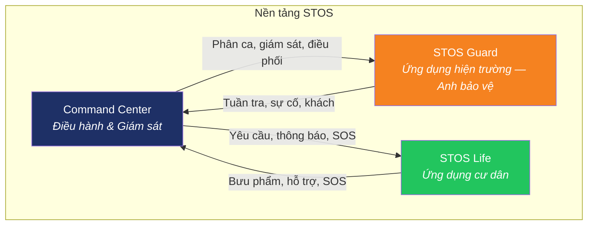

| Sản phẩm | Người dùng chính | Mục đích |
|----------|------------------|----------|
| **Command Center** | Giám đốc vận hành, điều phối viên, quản lý BQL | Trung tâm điều hành: KPI, tòa nhà, sự cố, CRM, báo cáo |
| **STOS Guard** | Nhân viên bảo vệ hiện trường | Điểm danh, tuần tra, nhận yêu cầu, SOS, đón khách, nhận hàng |
| **STOS Life** | Cư dân | Yêu cầu dịch vụ, bưu phẩm, SOS, thông báo BQL |

### 2.3. Phạm vi BRD này

- Mô tả **nghiệp vụ đầy đủ** của nền tảng STOS (hiện trạng + định hướng STOS Guard/Life).
- Không đề cập công nghệ triển khai.
- Là cơ sở cho PRD, thiết kế quy trình, đào tạo vận hành và hợp đồng SLA với khách hàng B2B.

---

## 3. Điểm mạnh cốt lõi của nền tảng

### 3.1. Tổng hợp theo trục giá trị

| # | Điểm mạnh | Mô tả ngắn | Lợi ích kinh doanh |
|---|-----------|------------|-------------------|
| 1 | **Đa tòa nhà — một điều hành** | Một công ty quản lý danh mục chung cư/tòa văn phòng tập trung | Giảm chi phí quản trị, nhìn toàn portfolio |
| 2 | **Tách bạch “hiện trường” vs “văn phòng”** | Bảo vệ tại tòa (`staff`) tách HR nội bộ (`employees`) | Rõ trách nhiệm, đúng quy trình lương & pháp lý |
| 3 | **Vòng đóng sự cố** | Từ phát hiện → phân loại → xử lý → timeline → đóng | Truy vết, báo cáo BQL, giảm tranh chấp |
| 4 | **Tuần tra có checkpoint** | Tuyến, điểm, % hoàn thành, cảnh báo bỏ sót | Chứng minh tuần tra thực tế, đáp SLA hợp đồng |
| 5 | **SOS & điều phối tự động** | Khẩn cấp → gán bảo vệ → cảnh báo điều hành | Rút ngắn thời gian phản ứng (golden time) |
| 6 | **Kiểm soát ra/vào** | Khách, shipper, thầu, VIP — check-in/out | An ninh, phân định trách nhiệm |
| 7 | **Dịch vụ cư dân tích hợp** | Bưu phẩm, ticket, thầu, nhóm cộng đồng | Một cửa cho BQL, tăng doanh thu dịch vụ |
| 8 | **CRM B2B** | Khách hàng BQL/chủ đầu tư, pipeline, gắn tòa | Hỗ trợ kinh doanh & mở rộng hợp đồng |
| 9 | **HR — Tài chính — Đào tạo** | Lương, hóa đơn, khóa học, chứng chỉ | Vận hành doanh nghiệp trọn gói |
| 10 | **Báo cáo & KPI** | SLA, tuần tra, sự cố, doanh thu, nhân sự | Ra quyết định dựa trên số liệu |
| 11 | **Đa khách hàng nền tảng (SaaS)** | Mỗi công ty dữ liệu riêng; nhà cung cấp quản tenant | Mô hình scale B2B |
| 12 | **Nhật ký & kiểm toán** | Mọi thay đổi quan trọng có thể truy vết | Tuân thủ, tranh chấp, nội bộ |
| 13 | **Cảnh báo & sự kiện thời gian thực** | Patrol missed, SOS, sự cố critical | Giám sát chủ động, không chờ báo cáo cuối ca |
| 14 | **Trợ lý điều hành (AI)** | Hỏi đáp tình hình tòa nhà, sự cố, nhân sự | Giảm tải điều phối, tra cứu nhanh |

### 3.2. Ma trận năng lực theo stakeholder

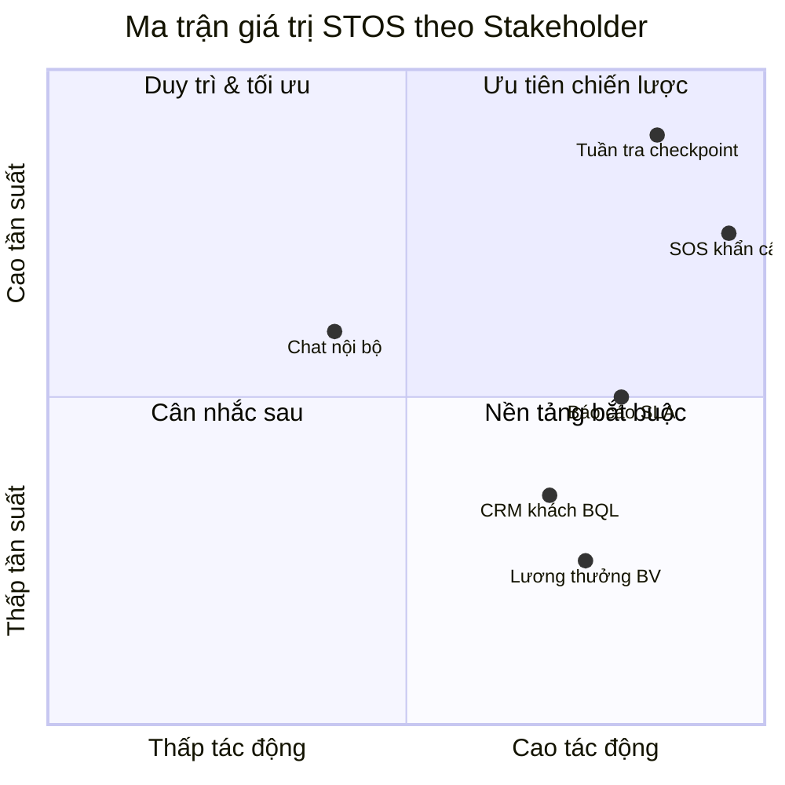

---

## 4. Kiến trúc nghiệp vụ tổng thể

### 4.1. Lớp kiến trúc logic

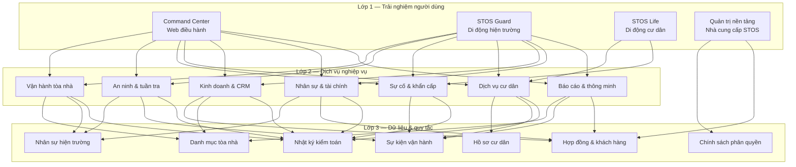

### 4.2. Mô hình thực thể nghiệp vụ (rút gọn)

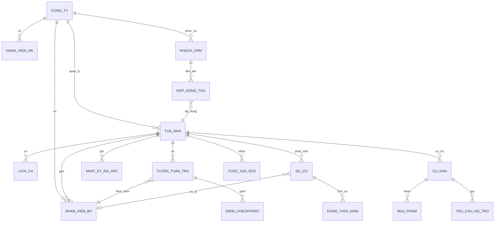

### 4.3. Luồng dữ liệu tổng quát trong một ngày vận hành

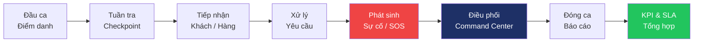

---

## 5. Mô hình tổ chức & đa khách hàng

### 5.1. Khái niệm Tenant (Công ty)

Mỗi **công ty** đăng ký STOS là một đơn vị vận hành độc lập:

- Có danh mục tòa nhà riêng.
- Có nhân sự, khách hàng CRM, hợp đồng, báo cáo riêng.
- **Không** nhìn thấy dữ liệu công ty khác.

### 5.2. Mô hình triển khai

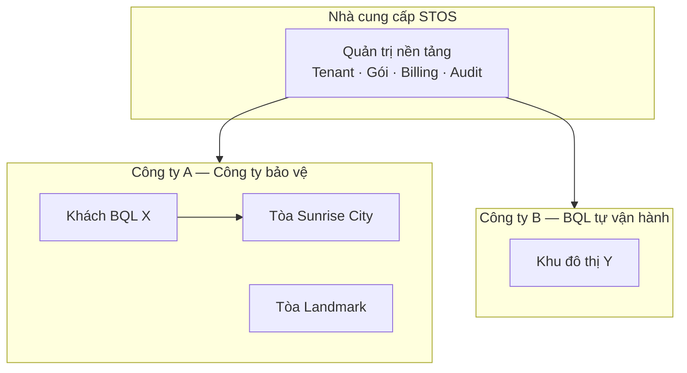

### 5.3. Quy tắc nghiệp vụ đa khách hàng

| Quy tắc | Mô tả |
|---------|--------|
| R-01 | Mọi bản ghi vận hành phải thuộc đúng một công ty |
| R-02 | Người dùng chỉ thao tác trong phạm vi công ty được gán |
| R-03 | Quản trị nền tảng có quyền xem/quản lý tất cả công ty (cho hỗ trợ & billing) |
| R-04 | Đăng ký mới có thể tạo công ty mặc định hoặc gán vào công ty có sẵn (theo chính sách onboarding) |

---

## 6. Vai trò & phân quyền nghiệp vụ

### 6.1. Danh mục vai trò

| Vai trò | Phạm vi | Quyền nghiệp vụ chính |
|---------|---------|----------------------|
| **Quản trị nền tảng** | Toàn hệ thống | Tenant, gói dịch vụ, user toàn nền tảng, audit |
| **Admin công ty** | Trong công ty | Cấu hình, phân quyền, CRM, tòa nhà, mọi module |
| **Điều hành (Operator)** | Trong công ty | Sự cố, cư dân, tuần tra, SOS, ra/vào — không HR/lương |
| **Quản lý HR** | Trong công ty | Nhân sự văn phòng, nghỉ phép, đào tạo, chứng chỉ |
| **Quản lý tài chính** | Trong công ty | Hóa đơn, bảng lương |
| **Bảo vệ (Guard)** | Hiện trường | Điểm danh, tuần tra, SOS, khách, yêu cầu được giao |
| **Cư dân (Resident)** | STOS Life | Yêu cầu dịch vụ, SOS, bưu phẩm — phạm vi căn hộ/tòa |

### 6.2. Ma trận RACI (rút gọn — module vận hành)

| Hoạt động | Admin | Operator | Guard | HR | Finance |
|-----------|:-----:|:--------:|:-----:|:--:|:-------:|
| Cấu hình tòa nhà | A/R | C | I | I | I |
| Phân ca | A | R | I | C | — |
| Tuần tra | A | R | R | — | — |
| Sự cố | A | R | R | — | — |
| SOS | A | R | R | — | — |
| Ra/vào khách | A | R | R | — | — |
| Bảng lương BV | A | I | I | R | A |
| Hóa đơn khách | A | C | — | I | R |

*A = Chịu trách nhiệm, R = Thực hiện, C = Tư vấn, I = Được thông báo*

---

## 7. Phân hệ nghiệp vụ chi tiết

### 7.1. Command Center — Tổng quan điều hành

**Mục đích:** Một màn hình cho lãnh đạo vận hành nắm tình hình toàn portfolio tòa nhà.

| Chỉ số / Khối thông tin | Nguồn nghiệp vụ | Hành vi mong đợi |
|-------------------------|-----------------|------------------|
| Tổng số tòa nhà | Danh mục tòa | Đếm realtime |
| Sự cố trong ngày | Sự cố theo ngày | Cảnh báo nếu vượt ngưỡng |
| Nhân viên online / tổng | Nhân sự BV + trạng thái | % sẵn sàng |
| SLA trung bình | KPI từng tòa | Màu xanh/vàng/đỏ |
| Cảnh báo (critical + warning) | Tòa + sự cố + tuần tra | Ưu tiên xử lý |
| Danh sách tòa gần đây | Tòa hoạt động | Drill-down chi tiết |

**Điểm mạnh:** Tập trung đa tòa; không cần gọi từng trưởng ca.

---

### 7.2. Tòa nhà / Chung cư

**Mục đích:** Đơn vị vận hành trung tâm — mọi module gắn với một tòa.

| Trường nghiệp vụ | Ý nghĩa |
|------------------|---------|
| Tên, địa chỉ, khu vực | Định danh & lọc |
| Trạng thái (bình thường / cảnh báo / nghiêm trọng) | Health score tòa |
| SLA % | Cam kết hợp đồng |
| Nhân sự online / tổng | Năng lực hiện trường |
| Sự cố hôm nay / nghiêm trọng | Rủi ro |
| % hoàn thành tuần tra | Chất lượng vận hành |

**Quy tắc:**

- BR-BLD-01: Không xóa tòa đang có sự cố mở hoặc ca trực active (trừ Admin).
- BR-BLD-02: Đổi trạng thái tòa phải ghi nhận sự kiện hệ thống.

---

### 7.3. Nhân sự bảo vệ (hiện trường)

**Khác biệt với HR:** Đây là người **đứng chốt tại tòa** — có trạng thái tuần tra, zone, check-in.

| Trạng thái | Ý nghĩa vận hành |
|------------|------------------|
| Đang trực | Trên ca, sẵn sàng |
| Đang tuần tra | Trên tuyến |
| Nghỉ | Không phân công |
| Offline | Không liên lạc được — cảnh báo |

**Điểm mạnh:** Liên kết trực tiếp SOS, tuần tra, sự cố — một hồ sơ một người tại tòa.

---

### 7.4. Ca trực & Tuần tra

#### Ca trực

| Ca | Khung giờ mặc định | Ghi chú |
|----|-------------------|---------|
| Sáng | 06:00 – 14:00 | Có thể cấu hình theo hợp đồng |
| Chiều | 14:00 – 22:00 | |
| Đêm | 22:00 – 06:00 | |

**Quy tắc:**

- BR-SHF-01: Một nhân viên không được gán hai ca chồng lấn cùng thời điểm tại cùng tòa.
- BR-SHF-02: Ca đêm chuyển giao phải có bàn giao (nghiệp vụ STOS Guard).

#### Tuần tra

| Thành phần | Mô tả |
|------------|--------|
| Tuyến tuần tra | Gắn tòa + (tùy chọn) nhân viên phụ trách |
| Checkpoint | Điểm bắt buộc: hành lang, thang bộ, hầm, sảnh… |
| % hoàn thành | Tự tính khi tick checkpoint |
| Trạng thái tuyến | Đang thực hiện / Hoàn thành / Bỏ sót (missed) |

**Điểm mạnh:** Chứng minh năng lực với BQL; phát hiện bỏ sót tự động.

---

### 7.5. SOS khẩn cấp

**Mục đích:** Kênh ưu tiên tuyệt đối — cư dân hoặc hiện trường báo nguy hiểm.

| Trạng thái SOS | Ý nghĩa |
|----------------|---------|
| Chờ xử lý | Mới tạo |
| Đã điều phối | Đã gán bảo vệ |
| Đang xử lý | Bảo vệ tại hiện trường |
| Đã xử lý | Đóng |
| Hủy / báo nhầm | Đóng không xử lý |

**Quy tắc nghiệp vụ:**

- BR-SOS-01: SOS mới phải tạo cảnh báo critical trên Command Center.
- BR-SOS-02: Ưu tiên điều phối bảo vệ đang `on-patrol` cùng tòa.
- BR-SOS-03: STOS Guard — kích hoạt SOS yêu cầu giữ nút tối thiểu 3 giây (chống bấm nhầm).

---

### 7.6. Kiểm soát ra / vào

| Loại khách | Quy trình |
|------------|-----------|
| Khách thường | Check-in → Check-out |
| Shipper | Check-in nhanh, ghi đơn |
| Nhà thầu | Gắn hồ sơ thầu / thời hạn |
| VIP | Ưu tiên, có thể thông báo trước |

**Điểm mạnh:** Một nhật ký duy nhất thay sổ tay cổng.

---

### 7.7. Sự cố

| Mức độ | Ví dụ | SLA phản hồi (tham chiếu) |
|--------|-------|---------------------------|
| Thấp | Đèn hỏng, ồn à | Theo hợp đồng |
| Trung bình | Tranh chấp nhỏ | |
| Cao | Đột nhập, cháy nhỏ | |
| Nghiêm trọng | Cháy, nguy hiểm tính mạng | Cảnh báo ngay + escalation |

**Thành phần:**

- Loại sự cố, mô tả, tòa, người xử lý.
- **Timeline** — mỗi bước: ai làm gì, lúc nào (kiểm toán).

---

### 7.8. Dịch vụ cư dân

| Dịch vụ | Mô tả |
|---------|--------|
| Bưu phẩm | Nhận → thông báo cư dân → giao |
| Yêu cầu hỗ trợ | Ticket có trạng thái & ưu tiên |
| Nhà thầu vào tòa | Liên kết kiểm soát ra/vào |
| Dịch vụ nhanh | Dọn, sửa, vận chuyển… |
| Nhóm cộng đồng (Zalo) | Kênh thông tin (tích hợp ngoài) |
| SOS | Liên kết mục 7.5 |

---

### 7.9. CRM — Khách hàng B2B

**Đối tượng:** Ban quản lý, chủ đầu tư, đơn vị thuê dịch vụ bảo vệ.

| Thực thể | Mô tả |
|----------|--------|
| Khách hàng | Pháp nhân / đại diện |
| Cơ hội (Pipeline) | Giai đoạn bán hàng |
| Liên kết tòa | Khách nào quản các tòa nào |
| Hóa đơn | Doanh thu từ khách |

**Điểm mạnh:** Nối kinh doanh với vận hành — biết tòa nào thuộc hợp đồng nào.

---

### 7.10. Nhân sự (HR) — Văn phòng

| Module con | Nội dung |
|------------|----------|
| Hồ sơ nhân viên | Mã NV, phòng ban, trạng thái |
| Chứng chỉ | PCCC, nghiệp vụ — hết hạn cảnh báo |
| Nghỉ phép | Đơn → duyệt → sự kiện |
| Đào tạo | Khóa học, đăng ký, hoàn thành |

*Tách biệt với nhân sự bảo vệ hiện trường để tránh nhầm lẫn lương ca vs lương văn phòng.*

---

### 7.11. Tài chính & Lương

| Module | Mô tả |
|--------|--------|
| Hóa đơn | Phát hành, trạng thái thanh toán, quá hạn |
| Bảng lương | Kỳ lương, thưởng, phạt, tổng nhận (STOS Guard — xem cá nhân) |

---

### 7.12. Truyền thông nội bộ

| Kênh | Mục đích |
|------|----------|
| Thông báo chính thức | Chính sách, nhắc ca |
| Bảng tin | Tin nội bộ |
| Chat kênh | Trao đổi nhanh điều hành — có kiểm soát |

---

### 7.13. Báo cáo tổng hợp

| Nhóm báo cáo | Nội dung |
|--------------|----------|
| Vận hành | SLA, tuần tra, sự cố theo tòa |
| Tài chính | Doanh thu, công nợ |
| Nhân sự | Biên chế, đào tạo |
| Khách hàng | CRM, hợp đồng |

**Điểm mạnh:** Xuất phục vụ họp BQL / chủ đầu tư — minh chứng SLA.

---

## 8. Luồng nghiệp vụ & sơ đồ tuần tự

### 8.1. Onboarding công ty mới (SaaS)

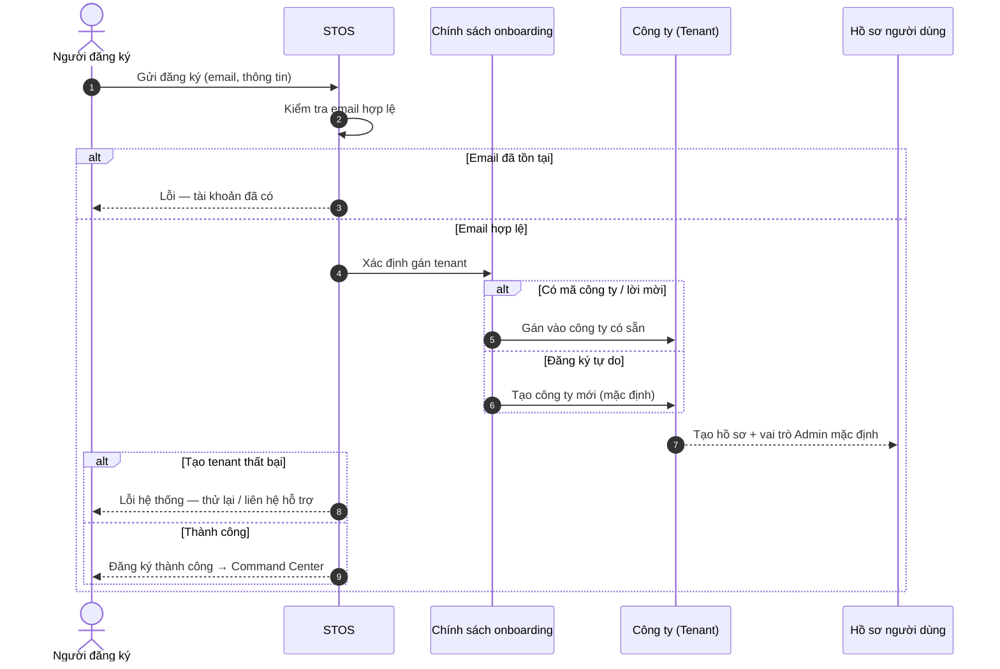

---

### 8.2. Điểm danh đầu ca (STOS Guard)

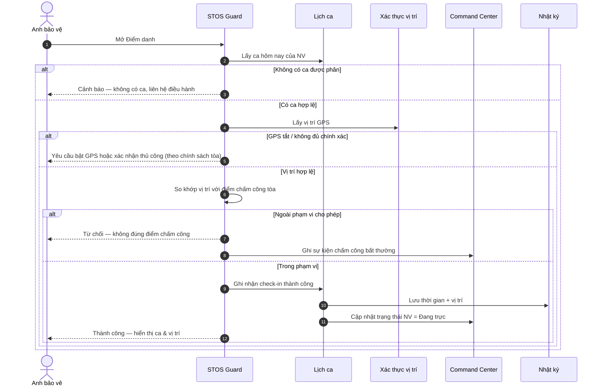

---

### 8.3. Tuần tra — thực hiện checkpoint

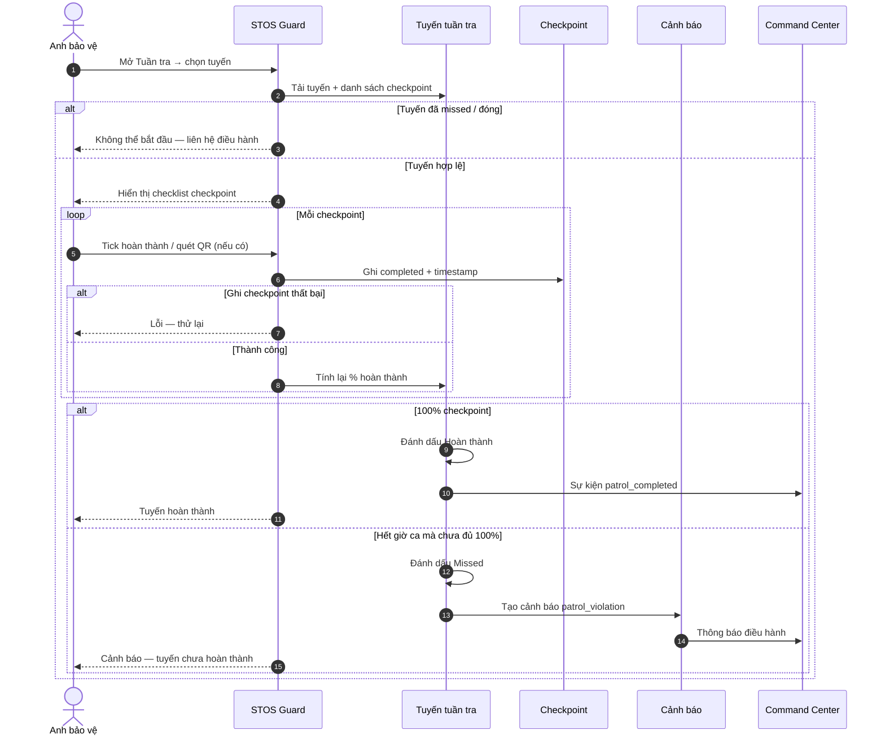

---

### 8.4. SOS khẩn cấp (từ cư dân hoặc hiện trường)

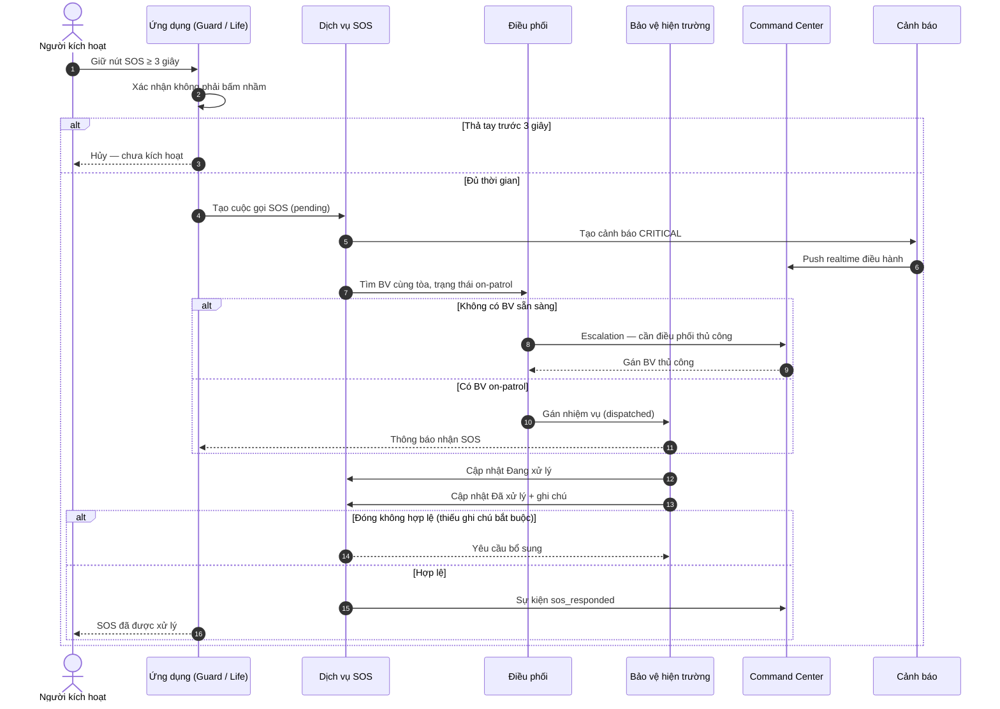

---

### 8.5. Xử lý sự cố

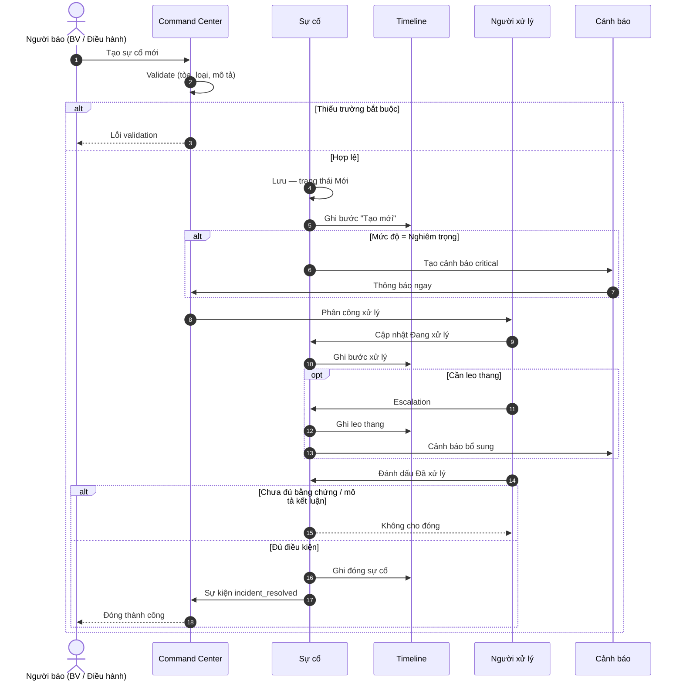

---

### 8.6. Kiểm soát khách — check-in / check-out

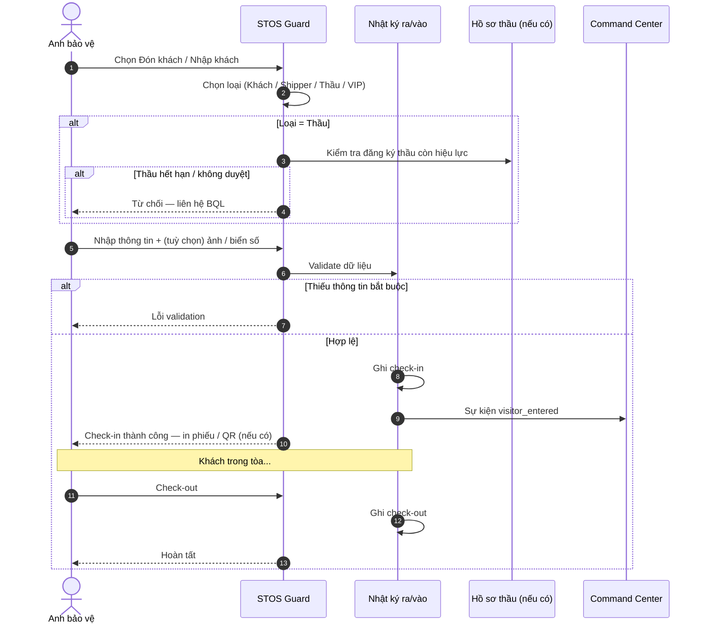

---

### 8.7. Nhận bưu phẩm (dịch vụ cư dân)

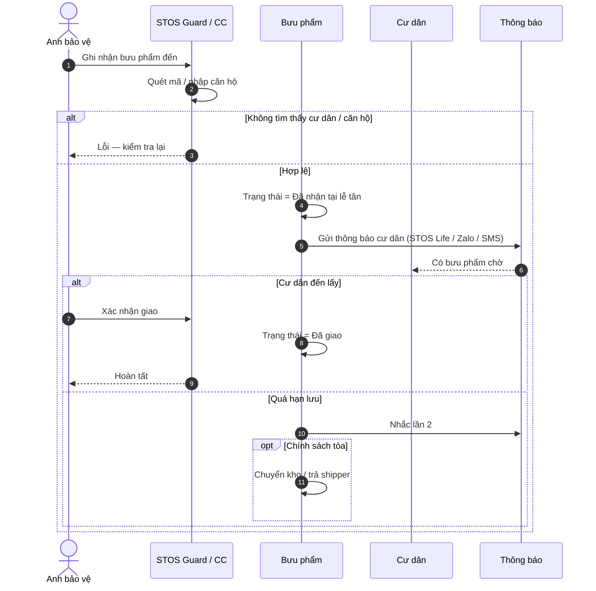

---

### 8.8. Phân công ca trực (Command Center)

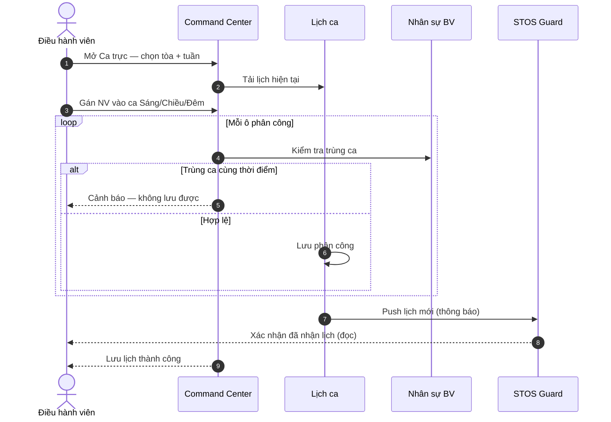

---

### 8.9. Duyệt nghỉ phép (HR)

```mermaid
sequenceDiagram
  autonumber
  actor Emp as Nhân viên
  participant HR as Module HR
  actor Mgr as Quản lý HR
  participant Shift as Lịch ca (nếu ảnh hưởng BV)

  Emp->>HR: Tạo đơn nghỉ
  HR->>HR: Validate ngày, loại nghỉ, số ngày còn lại

  alt Không đủ điều kiện
    HR-->>Emp: Từ chối — lý do
  else Gửi duyệt
  HR->>Mgr: Hàng đợi duyệt
  Mgr->>HR: Duyệt / Từ chối

  alt Từ chối
    HR-->>Emp: Thông báo từ chối
  else Duyệt
    HR->>HR: Cập nhật trạng thái Đã duyệt
    opt Nhân viên có lịch ca BV
      HR->>Shift: Cảnh báo cần thay ca
    end
    HR-->>Emp: Thông báo duyệt
  end
```

---

## 9. Chỉ số, báo cáo & giám sát

### 9.1. Bộ KPI chuẩn theo tòa nhà

| KPI | Công thức nghiệp vụ | Ngưỡng tham chiếu |
|-----|---------------------|-------------------|
| **SLA %** | (Thời gian đáp ứng cam kết / Tổng yêu cầu) × 100 | ≥ 95% xanh |
| **Tuần tra %** | Checkpoint hoàn thành / Tổng checkpoint | ≥ 90% |
| **Sự cố mở** | Đếm sự cố chưa đóng | 0 = tốt |
| **Sự cố nghiêm trọng** | Đếm trong kỳ | 0 = tốt |
| **NV online** | Đang trực / Tổng phân ca | Theo hợp đồng |
| **Thời gian phản hồi SOS** | dispatched_at − created_at | Theo SLA vàng |

### 9.2. Dashboard phân tầng

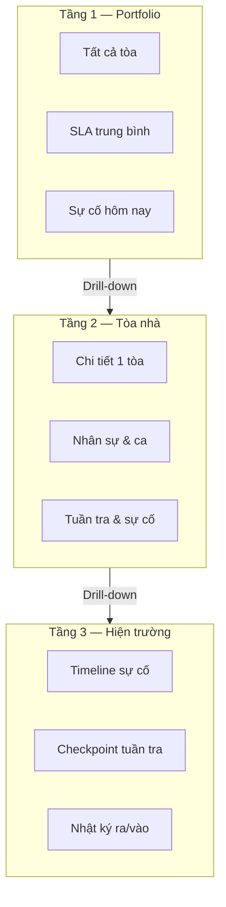

---

## 10. Hệ sinh thái sản phẩm tương lai

### 10.1. STOS Guard — yêu cầu nghiệp vụ (định hướng)

Dựa trên thiết kế ứng dụng nhân viên bảo vệ:

| Màn hình | Chức năng bắt buộc |
|----------|---------------------|
| Trang chủ | 8 hành động nhanh + trạng thái ca |
| Lịch làm việc | Ca Sáng/Chiều/Đêm theo tuần |
| Điểm danh | GPS + xác nhận vị trí |
| Tuần tra | Checklist checkpoint |
| Nhận yêu cầu | Ticket từ điều hành / cư dân |
| Xử lý tình huống | Phân loại sự cố nhanh |
| SOS | Giữ nút 3 giây |
| Đón khách | Khách có/không đăng ký, QR |
| Nhận đồ/hàng | Shipper, giao cư dân, locker |
| Thông báo | Chính sách, nhắc ca |
| Tài khoản | Hồ sơ, lương thưởng phạt |

**Luồng ngày chuẩn (STOS Guard):**

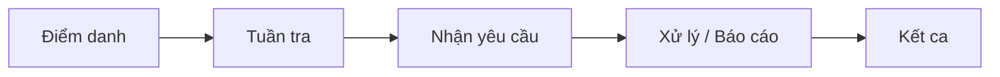

### 10.2. STOS Life — định hướng

- Cư dân: yêu cầu dịch vụ, theo dõi bưu phẩm, SOS, thông báo BQL.
- Liên thông Command Center — không tách kênh xử lý.

### 10.3. Lộ trình năng lực nền tảng (góc nhìn kinh doanh)

| Giai đoạn | Năng lực |
|-----------|----------|
| **Hiện tại** | Command Center đầy đủ module; dữ liệu vận hành thống nhất |
| **Giai đoạn 2** | STOS Guard — trải nghiệm hiện trường đúng persona |
| **Giai đoạn 3** | STOS Life — cư dân & BQL cộng đồng |
| **Giai đoạn 4** | Marketplace / đối tác (Farm Fresh, dịch vụ mở rộng) |

---

## 11. Phụ lục — từ điển nghiệp vụ

| Thuật ngữ | Định nghĩa |
|-----------|------------|
| **Tenant / Công ty** | Khách hàng SaaS — đơn vị sở hữu dữ liệu |
| **Tòa nhà** | Đơn vị vận hành — chung cư, tòa văn phòng, khu đô thị |
| **Nhân viên bảo vệ** | Người hiện trường, gắn tòa, có ca & tuần tra |
| **Nhân viên HR** | Nhân sự văn phòng công ty bảo vệ |
| **Checkpoint** | Điểm bắt buộc trên tuyến tuần tra |
| **SOS** | Tín hiệu khẩn cấp — ưu tiên tuyệt đối |
| **SLA** | Cam kết mức dịch vụ với khách hàng B2B |
| **Pipeline** | Cơ hội bán hàng CRM |
| **Command Center** | Trung tâm điều hành giám sát |
| **Missed (patrol)** | Tuyến tuần tra không hoàn thành đúng hạn |

---

## Phê duyệt tài liệu

| Vai trò | Họ tên | Chữ ký | Ngày |
|---------|--------|--------|------|
| Chủ sản phẩm | | | |
| Trưởng vận hành | | | |
| Đại diện kinh doanh | | | |

---

*Tài liệu này mô tả nghiệp vụ nền tảng STOS. Mọi thay đổi phạm vi cần được đánh giá tác động chéo giữa Command Center, STOS Guard và STOS Life trước khi phê duyệt triển khai.*
