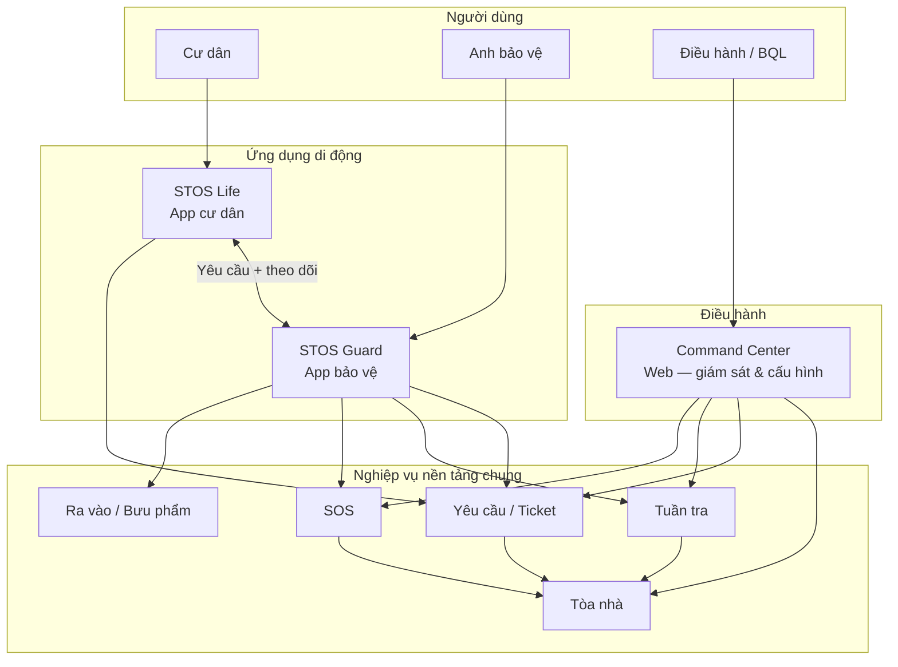
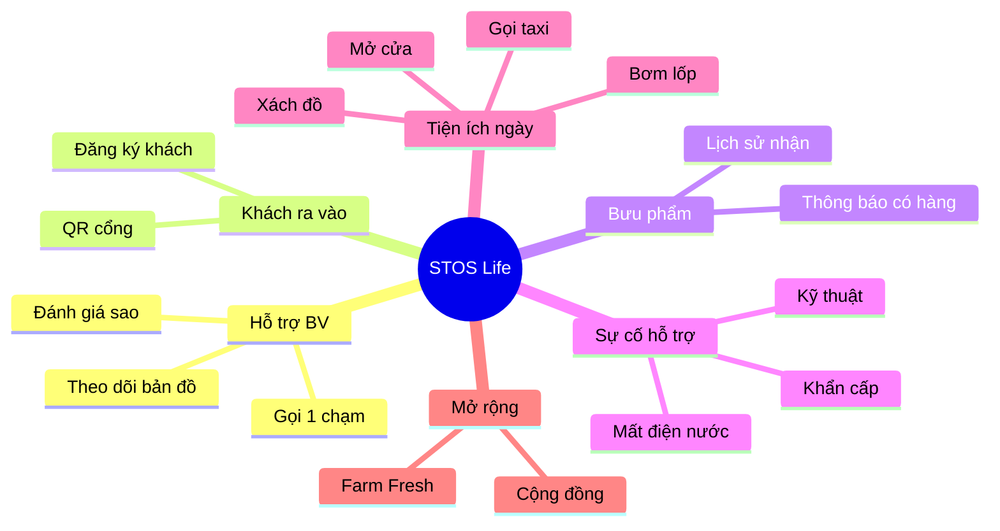
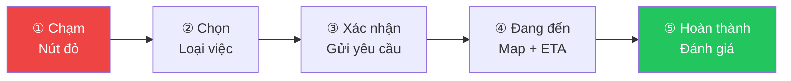
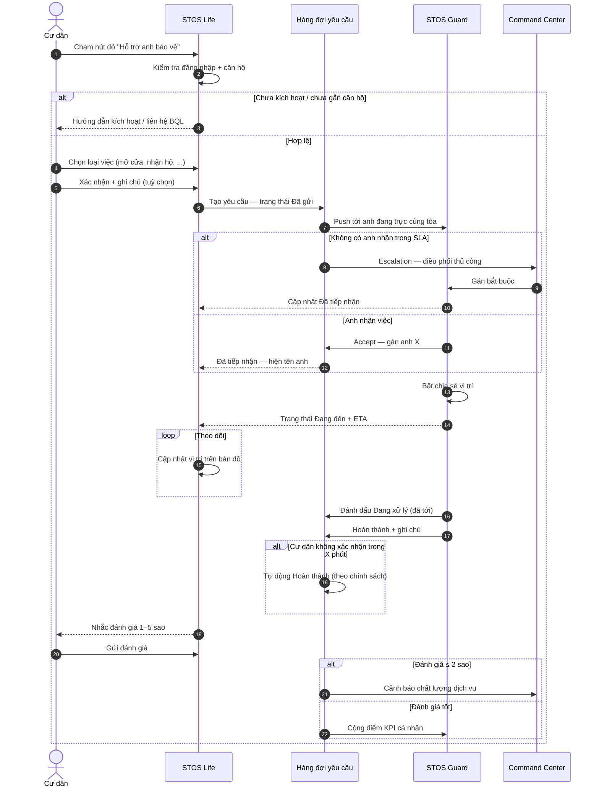
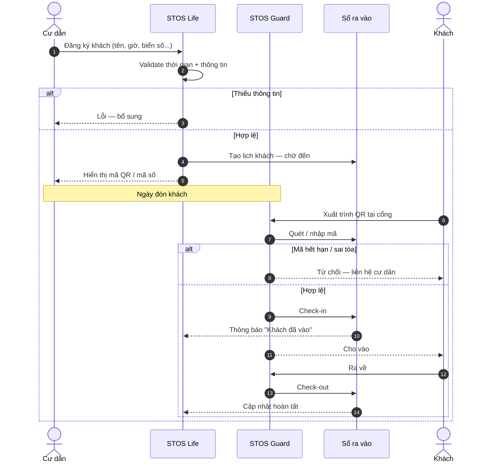
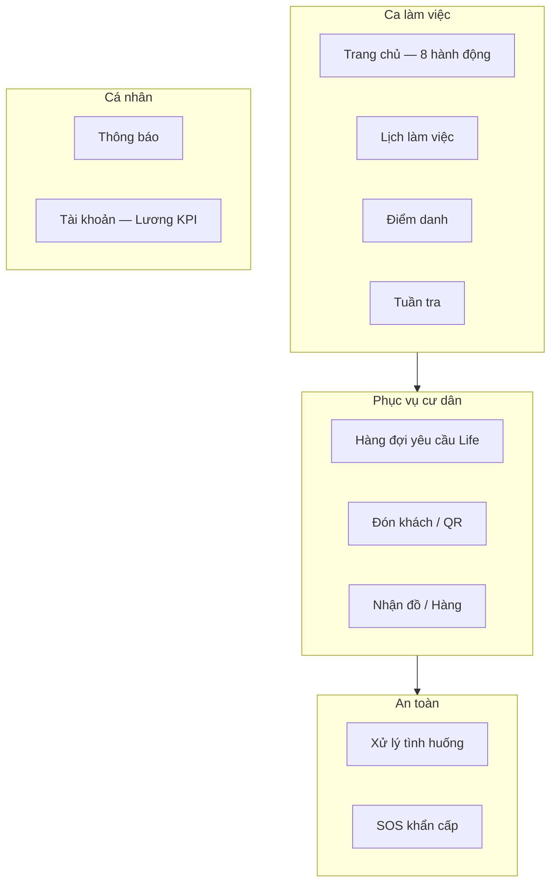
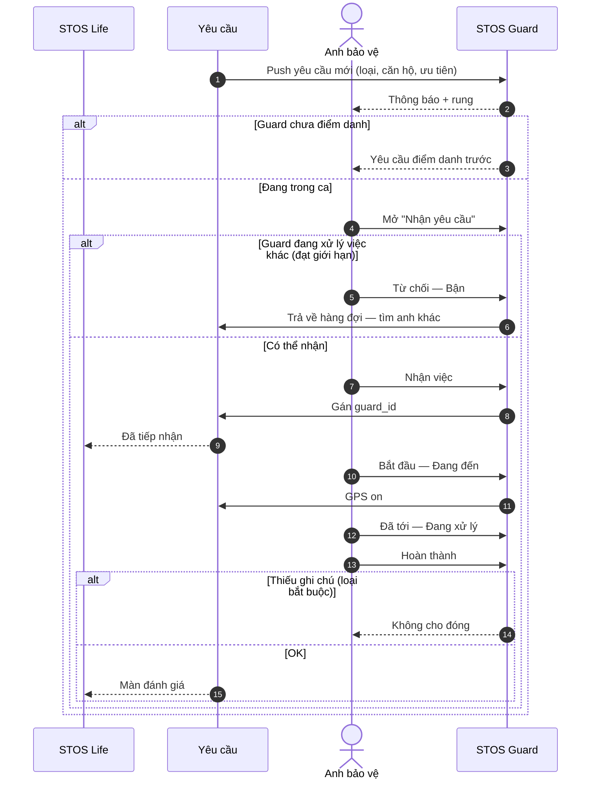
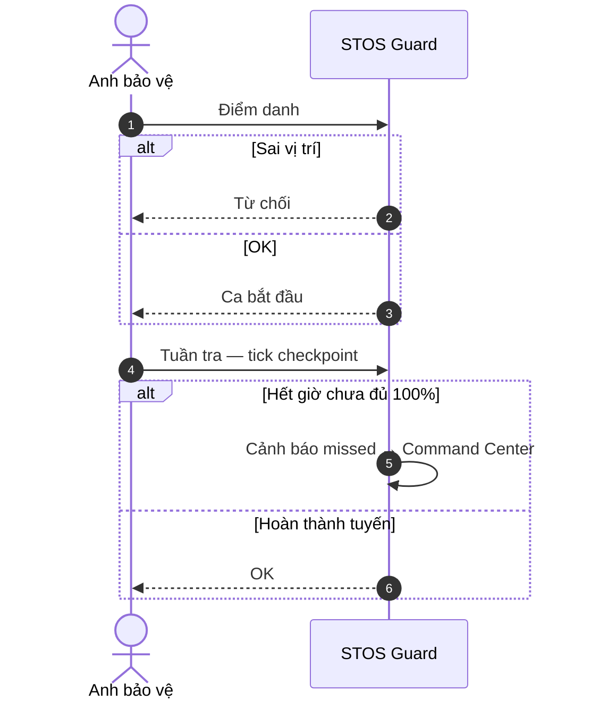
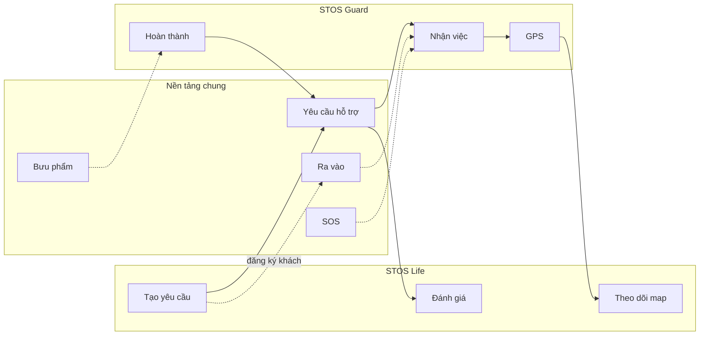
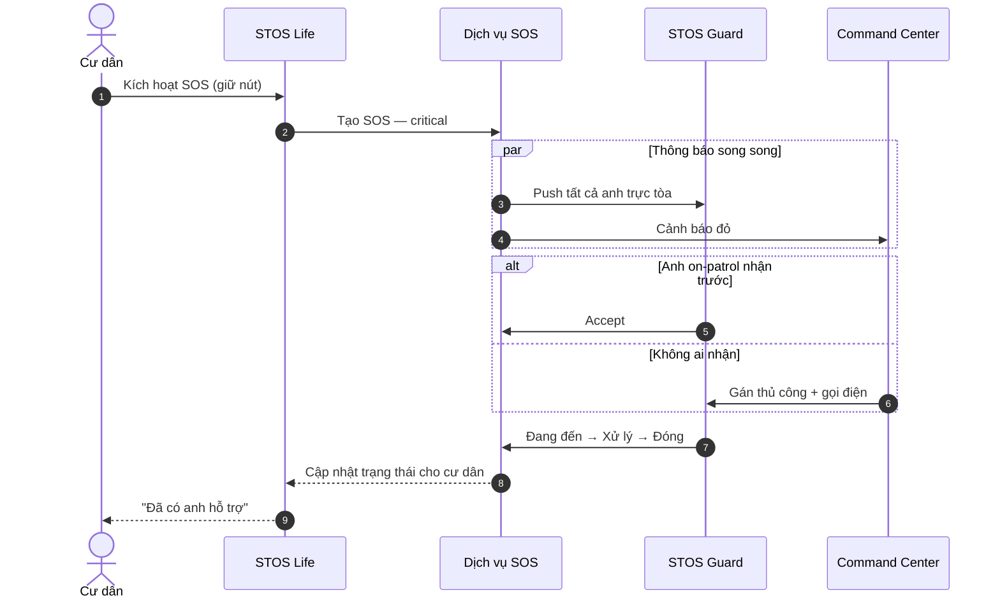

# BRD — Hai Phân Hệ Ứng Dụng Di Động STOS
## STOS Guard & STOS Life

| Thuộc tính | Giá trị |
|------------|---------|
| **Phiên bản** | 1.0 |
| **Ngày** | 18/05/2026 |
| **Trạng thái** | Draft — căn cứ thiết kế sản phẩm & nền tảng STOS |
| **Liên quan** | [STOS_BRD.md](./STOS_BRD.md) — nền tảng tổng thể |
| **Phạm vi** | Chỉ hai app mobile; không mô tả Command Center (web) chi tiết |

---

## Mục lục

1. [Tóm tắt & phân tách hai app](#1-tóm-tắt--phân-tách-hai-app)
2. [Vị trí trong hệ sinh thái STOS](#2-vị-trí-trong-hệ-sinh-thái-stos)
3. [So sánh nhanh STOS Guard vs STOS Life](#3-so-sánh-nhanh-stos-guard-vs-stos-life)
4. [BRD — STOS Life (Ứng dụng cư dân)](#4-brd--stos-life-ứng-dụng-cư-dân)
5. [BRD — STOS Guard (Ứng dụng bảo vệ)](#5-brd--stos-guard-ứng-dụng-bảo-vệ)
6. [Luồng liên thông giữa hai app](#6-luồng-liên-thông-giữa-hai-app)
7. [Chỉ số thành công chung](#7-chỉ-số-thành-công-chung)
8. [Phụ lục](#8-phụ-lục)

---

## 1. Tóm tắt & phân tách hai app

Nền tảng STOS cần **hai ứng dụng di động riêng biệt**, phục vụ **hai persona đối lập** nhưng **nối một luồng nghiệp vụ**:

| App | Khẩu hiệu (định hướng) | Một câu |
|-----|------------------------|---------|
| **STOS Life** | *"Có việc gì, cứ gọi anh!"* | App **cư dân** — đặt yêu cầu, theo dõi anh bảo vệ như “Grab nội khu” |
| **STOS Guard** | *"Đơn giản — Dùng được mọi nơi"* | App **anh bảo vệ** — nhận việc, thực hiện ca, tuần tra, SOS, đón khách |

**Lưu ý:** App mobile hiện có trong repo (`mobile/`) là **Command Center thu gọn** (điều hành xem KPI). **Không thay thế** STOS Guard hay STOS Life — hai phân hệ trong tài liệu này là **sản phẩm mới** cần triển khai.

---

## 2. Vị trí trong hệ sinh thái STOS

### Vai trò từng kênh

| Kênh | Ai dùng | Việc chính |
|------|---------|------------|
| **STOS Life** | Cư dân đã kích hoạt tài khoản theo căn hộ/tòa | Gọi hỗ trợ, đăng ký khách, xem bưu phẩm, SOS, cộng đồng |
| **STOS Guard** | Nhân viên bảo vệ được phân ca tại tòa | Điểm danh, tuần tra, **nhận & xử lý yêu cầu từ Life**, khách, hàng, SOS |
| **Command Center** | Điều hành, admin | Giám sát toàn bộ, can thiệp khi quá tải, cấu hình dịch vụ & SLA |

---

## 3. So sánh nhanh STOS Guard vs STOS Life

| Tiêu chí | STOS Life | STOS Guard |
|----------|-----------|------------|
| **Đối tượng** | Cư dân (hộ gia đình) | Nhân viên bảo vệ |
| **Tâm lý sử dụng** | Chủ động “gọi dịch vụ” | Phản ứng “nhận & làm việc” |
| **Màn hình trung tâm** | Nút đỏ **Gọi anh bảo vệ** | Lưới ca làm việc + hàng đợi yêu cầu |
| **Định vị** | An toàn & tiện ích hàng ngày | Chuyên nghiệp, tập trung, ít thao tác |
| **Theo dõi vị trí** | Xem anh đang đến | Chia sẻ vị trí khi nhận việc |
| **Đánh giá** | Cư dân chấm sao sau khi xong | Xem điểm đánh giá cá nhân |
| **Ca trực / Tuần tra** | Không | Có — lõi vận hành |
| **Farm Fresh / Cộng đồng** | Có | Không (hoặc chỉ xem thông báo) |
| **Phạm vi dữ liệu** | Căn hộ + tòa của mình | Tòa được phân công trong ca |

---

# 4. BRD — STOS Life (Ứng dụng cư dân)

## 4.1. Tầm nhìn & định vị

**STOS Life** là cổng **cư dân – ban quản lý – đội bảo vệ**, biến anh bảo vệ từ “người gác cổng” thành **trợ lý an ninh & tiện ích nội khu 24/7**.

| Yếu tố | Nội dung |
|--------|----------|
| **Tagline** | An toàn hơn — An tâm mỗi ngày |
| **Thông điệp cốt lõi** | *Có việc gì, cứ gọi anh!* |
| **Killer feature** | **Grab cư dân nội khu** — một chạm → chọn việc → anh bảo vệ nhận → theo dõi trên bản đồ → hoàn thành & đánh giá |
| **Cam kết vận hành** | Phản hồi nhanh (mục tiêu 2–5 phút tiếp nhận; ≤ 5 phút trung bình theo KPI) |
| **Phạm vi** | Một tòa / khu đô thị đã triển khai STOS |

## 4.2. Đối tượng người dùng

| Persona | Mô tả | Nhu cầu |
|---------|--------|---------|
| **Cư dân thường** | Người lớn trong căn hộ | Gọi hỗ trợ nhanh, đón khách, nhận hàng |
| **Hộ có người già / trẻ nhỏ** | Ưu tiên an toàn | SOS, hỗ trợ khẩn, thông báo BQL |
| **Cư dân bận rộn** | Ít thời gian | Đặt trước khách, theo dõi shipper, Farm Fresh |
| **Ban quản lý (BQL)** | Không phải user Life chính | Phát hành thông báo, sự kiện — qua Command Center hoặc module Cộng đồng |

**Không dùng STOS Life:** nhân viên bảo vệ (dùng Guard), điều hành doanh nghiệp (dùng Command Center).

## 4.3. Sáu nhóm dịch vụ (theo thiết kế sản phẩm)

### Chi tiết từng nhóm

| # | Nhóm | Nghiệp vụ | Mô tả |
|---|------|-----------|--------|
| 1 | **Hỗ trợ anh bảo vệ** (killer) | Gọi nhanh, chọn loại việc, theo dõi, đánh giá | Trái tim của app — liên kết trực tiếp STOS Guard |
| 2 | **Đón khách & Ra vào** | Đăng ký khách trước, QR ra/vào, lịch sử | Giảm tắc cổng, minh bạch với BQL |
| 3 | **Nhận hàng** | Biết khi có bưu phẩm, trạng thái lưu/giao | Đồng bộ với bảo vệ ghi nhận tại lễ tân |
| 4 | **Sự cố & Hỗ trợ** | Báo sự cố kỹ thuật, điện nước, khẩn cấp không phải SOS | Tạo ticket có ưu tiên |
| 5 | **Hỗ trợ hàng ngày** | Taxi, bơm lốp, xách đồ, mở cửa… | Danh mục “việc vặt” có phí (nếu BQL quy định) |
| 6 | **Farm Fresh** | Đặt thực phẩm tươi giao tận căn hộ | Doanh thu thêm; đơn hàng tách luồng với “gọi anh” |
| 7 | **Cộng đồng** | Sự kiện, thông báo BQL, kết nối hàng xóm | Tăng gắn kết, tỷ lệ cài app |

## 4.4. Cấu trúc màn hình (IA)

| Màn / Tab | Chức năng |
|-----------|-----------|
| **Trang chủ** | Lời chào + thời tiết; **nút đỏ tròn “Hỗ trợ anh bảo vệ”**; shortcut: Khách, Bưu phẩm, Sự cố, Ra vào |
| **Chọn dịch vụ** | Danh sách icon + mô tả: mở cửa, nhận hộ, kỹ thuật, xách đồ, khẩn cấp… |
| **Xác nhận yêu cầu** | Tóm tắt loại việc, căn hộ, ghi chú; gửi |
| **Đang xử lý** | Trạng thái: đã tiếp nhận / anh đang đến |
| **Theo dõi bản đồ** | Tên anh (vd. Anh Minh), ETA, nút gọi điện |
| **Hoàn thành & Đánh giá** | 1–5 sao + góp ý |
| **Khách / Ra vào** | Đăng ký, QR, lịch sử |
| **Bưu phẩm** | Danh sách đang chờ / đã nhận |
| **Farm Fresh** | Catalog, giỏ hàng, đơn hàng |
| **Cộng đồng** | Feed thông báo, sự kiện |
| **Tài khoản** | Hồ sơ căn hộ, cài đặt, lịch sử yêu cầu, SOS |

## 4.5. Hành trình 5 bước — “Grab cư dân”

## 4.6. Quy tắc nghiệp vụ STOS Life

| Mã | Quy tắc |
|----|---------|
| BR-LIFE-01 | Cư dân chỉ tạo yêu cầu trong phạm vi **căn hộ + tòa** đã đăng ký |
| BR-LIFE-02 | Mỗi yêu cầu “gọi anh” phải có **loại dịch vụ** và trạng thái lifecycle rõ ràng |
| BR-LIFE-03 | Không cho hủy yêu cầu khi anh đã **đang đến** (chỉ gọi điện / escalation) |
| BR-LIFE-04 | SOS / Khẩn cấp **ưu tiên hơn** việc vặt — nhảy hàng đợi Guard |
| BR-LIFE-05 | Đánh giá chỉ mở sau trạng thái **Hoàn thành** |
| BR-LIFE-06 | Thông báo đẩy khi: tiếp nhận, anh đang đến, hoàn thành, có bưu phẩm |
| BR-LIFE-07 | Farm Fresh là đơn hàng riêng — không trộn timeline với “gọi anh” |

## 4.7. Trạng thái yêu cầu (cư dân nhìn thấy)

| Trạng thái | Ý nghĩa | Hiển thị |
|------------|---------|----------|
| Đã gửi | Chờ bảo vệ nhận | “Đang tìm anh hỗ trợ…” |
| Đã tiếp nhận | Anh X nhận việc | Tên + avatar |
| Đang đến | GPS active | Bản đồ + ETA |
| Đang xử lý | Đã tới căn hộ | “Anh đang hỗ trợ bạn” |
| Hoàn thành | Xong | Màn đánh giá |
| Đã hủy | Cư dân/BQL hủy sớm | Thông báo lý do |
| Quá hạn | Không ai nhận trong SLA | Gợi ý gọi lễ tân / Command Center |

## 4.8. Sequence — Cư dân gọi anh bảo vệ (end-to-end)

## 4.9. Sequence — Đăng ký khách + QR

## 4.10. KPI STOS Life (theo thiết kế)

| KPI | Mục tiêu | Ghi chú |
|-----|----------|---------|
| Thời gian phản hồi trung bình | ≤ 5 phút | Từ gửi → anh tiếp nhận |
| NPS cư dân | ≥ 50 điểm | Khảo sát định kỳ |
| Tỷ lệ tải app | ≥ 70% hộ | Theo tòa triển khai |
| Tỷ lệ kích hoạt | ≥ 60% | Đăng nhập + 1 yêu cầu/tháng |
| Tỷ lệ hoàn thành yêu cầu | ≥ 95% | Không treo trạng thái |
| Đánh giá trung bình | ≥ 4.2 / 5 | Gắn KPI anh bảo vệ |

---

# 5. BRD — STOS Guard (Ứng dụng bảo vệ)

## 5.1. Tầm nhìn & định vị

**STOS Guard** là công cụ **hiện trường** cho nhân viên bảo vệ: hoàn thành ca trực, tuần tra, và **phục vụ yêu cầu từ STOS Life** — chuyên nghiệp, ít thao tác, dùng được trong điều kiện mạng yếu.

| Yếu tố | Nội dung |
|--------|----------|
| **Tagline** | Đơn giản — Dùng được mọi nơi |
| **Giá trị** | Tận tâm — Chuyên nghiệp — Trách nhiệm |
| **Lõi nghiệp vụ** | Ca trực → Điểm danh → Tuần tra → Nhận việc Life → Khách/Hàng/SOS → Kết ca |
| **Phạm vi** | Tòa được phân công trong ca hiện tại |

## 5.2. Đối tượng người dùng

| Persona | Vai trò | Nhu cầu |
|---------|---------|---------|
| **Bảo vệ ca sáng/chiều/đêm** | Trực chốt, tuần tra | Điểm danh, checklist, nhận việc |
| **Bảo vệ cổng** | Khách, shipper | Check-in/out, quét QR, nhận hàng |
| **Bảo vệ tuần tra** | Di động trong tòa | Tick checkpoint, báo bất thường |
| **Trưởng ca** (tuỳ chính sách) | Giám sát ca | Xem việc chưa nhận, hỗ trợ điều phối |

**Không dùng STOS Guard:** cư dân, kế toán, CRM — dùng Life hoặc Command Center.

## 5.3. Mười nhóm nghiệp vụ

### Bảng chi tiết màn hình (theo thiết kế STOS Guard)

| # | Màn hình | Nghiệp vụ |
|---|----------|-----------|
| 1 | **Trang chủ** | Header: tên anh, ca hiện tại, tòa; **8 nút**: Điểm danh, Tuần tra, Nhận yêu cầu, Xử lý tình huống, Đón khách, Nhận đồ, SOS, Thông báo |
| 2 | **Lịch làm việc** | Lịch tuần: ca Sáng 06–14, Chiều 14–22, Đêm 22–06 |
| 3 | **Điểm danh** | Xác nhận giờ + **vị trí** (cổng chính, tòa A…) |
| 4 | **Tuần tra** | Chọn tuyến → checklist checkpoint → tick / quét QR |
| 5 | **Nhận yêu cầu** | Danh sách ticket từ Life: kỹ thuật, dọn, giao hàng… — **Nhận / Từ chối** |
| 6 | **Xử lý tình huống** | Báo nhanh: xâm nhập, kỹ thuật, y tế, cháy, khác |
| 7 | **SOS khẩn cấp** | Nút đỏ — **giữ 3 giây** — gửi vị trí |
| 8 | **Đón khách** | Khách có/không đăng ký; quét QR cư dân |
| 9 | **Nhận đồ / Hàng** | Shipper, giao cư dân, smart locker |
| 10 | **Thông báo** | Chính sách, thưởng/phạt, nhắc ca |
| 11 | **Tài khoản** | Mã NV, phòng ban; **lương + thưởng − phạt = thực nhận** |

## 5.4. Điều hướng (Tab bar)

| Tab | Nội dung |
|-----|----------|
| **Trang chủ** | Lưới hành động + trạng thái ca |
| **Lịch** | Ca tuần |
| **Thông báo** | Hàng đợi thông báo & yêu cầu mới |
| **Tài khoản** | Hồ sơ, lương, đăng xuất |

## 5.5. Nghiệp vụ đặc thù — Phục vụ STOS Life

Đây là **khác biệt lớn nhất** so với app điều hành:

| Chức năng Guard | Mô tả |
|-----------------|--------|
| **Hàng đợi yêu cầu** | Realtime danh sách yêu cầu Life theo tòa — sắp theo ưu tiên |
| **Nhận việc** | Accept → cư dân thấy tên anh trên Life |
| **Từ chối / Bận** | Phải có lý do; chuyển anh khác hoặc escalation |
| **Chia sẻ vị trí** | Bật khi Đang đến — tắt khi Hoàn thành |
| **Cập nhật trạng thái** | Đã tới căn hộ → Đang xử lý → Hoàn thành |
| **Gọi cư dân** | Nút gọi từ màn chi tiết yêu cầu |
| **Xem đánh giá** | Lịch sử sao từ cư dân — KPI cá nhân |

## 5.6. Quy tắc nghiệp vụ STOS Guard

| Mã | Quy tắc |
|----|---------|
| BR-GUARD-01 | Chỉ thao tác khi **đã điểm danh** ca (trừ SOS khẩn cấp) |
| BR-GUARD-02 | Tuần tra: không bỏ qua checkpoint bắt buộc — cảnh báo missed |
| BR-GUARD-03 | SOS: giữ nút ≥ 3 giây; luôn ghi vị trí |
| BR-GUARD-04 | Yêu cầu Life khẩn cấp **không được từ chối** nếu trong ca và không bận yêu cầu khác |
| BR-GUARD-05 | Tối đa **N** yêu cầu đồng thời (cấu hình theo tòa, mặc định 1) |
| BR-GUARD-06 | Hoàn thành yêu cầu Life bắt buộc có **ghi chú** nếu loại = sự cố |
| BR-GUARD-07 | QR khách phải khớp tòa + thời hạn đăng ký |
| BR-GUARD-08 | Dữ liệu lương trên app **chỉ đọc** — không sửa |

## 5.7. Trạng thái yêu cầu Life (phía Guard)

| Trạng thái | Hành động Guard |
|------------|-----------------|
| Mới | Nhận / Bỏ qua (có lý do) |
| Đã nhận | Bắt đầu di chuyển — bật GPS |
| Đang đến | Cập nhật ETA |
| Tại chỗ | Bắt đầu xử lý |
| Hoàn thành | Đóng + ghi chú |
| Escalation | Chuyển Command Center |

## 5.8. Sequence — Guard nhận yêu cầu từ Life

## 5.9. Sequence — Điểm danh + Tuần tra (tóm tắt)

*(Chi tiết đầy đủ tham chiếu mục 8.2–8.3 trong [STOS_BRD.md](./STOS_BRD.md))*

## 5.10. Thông tin cá nhân & lương (tab Tài khoản)

| Khối | Nội dung |
|------|----------|
| Hồ sơ | Mã NV, họ tên, phòng ban, tòa đang trực |
| Lương kỳ | Lương cơ bản + thưởng − phạt = thực nhận |
| KPI | Số yêu cầu Life hoàn thành, đánh giá TB, % tuần tra |
| Hỗ trợ | Hotline 24/7 (vd. 1900 888 999 — theo hợp đồng BQL) |

---

## 6. Luồng liên thông giữa hai app

### 6.1. Bản đồ tích hợp nghiệp vụ

### 6.2. Ma trận tính năng — Ai khởi tạo, ai xử lý

| Nghiệp vụ | STOS Life | STOS Guard | Command Center |
|-----------|:---------:|:----------:|:--------------:|
| Gọi anh hỗ trợ (Grab) | **Tạo** | **Xử lý** | Giám sát |
| Đăng ký khách | **Tạo** | Check-in/out | Xem nhật ký |
| Bưu phẩm — thông báo | Nhận TT | **Ghi nhận** | Quản lý |
| SOS cư dân | **Kích hoạt** | **Xử lý** | Cảnh báo |
| SOS hiện trường | — | **Kích hoạt** | Cảnh báo |
| Tuần tra | — | **Thực hiện** | Giám sát |
| Điểm danh | — | **Thực hiện** | Báo cáo |
| Farm Fresh | **Đặt hàng** | Giao (tuỳ mô hình) | Báo cáo DT |
| Thông báo BQL | Đọc | Đọc | **Tạo** |
| Đánh giá anh | **Gửi** | Xem | Báo cáo |

### 6.3. Sequence — SOS từ cư dân (ưu tiên tuyệt đối)

---

## 7. Chỉ số thành công chung

### 7.1. KPI theo app

| KPI | STOS Life | STOS Guard |
|-----|-----------|------------|
| Thời gian tiếp nhận yêu cầu | ≤ 5 phút (TB) | % nhận trong 2 phút |
| Hoàn thành đúng hạn | ≥ 95% | ≥ 98% ca tuần tra |
| Hài lòng cư dân (sao) | ≥ 4.2/5 | TB điểm cá nhân |
| Adoption | 70% tải, 60% active | 100% anh trong ca dùng app |
| SOS response | — | ≤ 3 phút dispatch |

### 7.2. Dashboard Command Center (giám sát chéo)

Điều hành cần thấy **cùng một sự kiện** từ hai phía:

- Cư dân A gửi yêu cầu lúc 14:02 → Anh Minh nhận 14:03 → Hoàn thành 14:18 → 5 sao.

---

## 8. Phụ lục

### 8.1. Phân biệt app mobile trong repo

| App | Thư mục / trạng thái | Persona |
|-----|----------------------|---------|
| Command Center mobile (hiện có) | `mobile/` — MVP xem dữ liệu | Điều hành |
| **STOS Life** (BRD này) | Chưa triển khai riêng | Cư dân |
| **STOS Guard** (BRD này) | Chưa triển khai riêng | Bảo vệ |

### 8.2. Ánh xạ nghiệp vụ → dữ liệu nền tảng (tham chiếu)

| Nghiệp vụ Life/Guard | Thực thể nền tảng (đã có trên STOS) |
|----------------------|-------------------------------------|
| Gọi anh / Việc vặt | `support_requests`, `quick_service_requests` |
| Bưu phẩm | `parcels` |
| Khách QR | `access_logs`, `residents` |
| SOS | `sos_calls` |
| Tuần tra | `patrol_routes`, `patrol_checkpoints` |
| Ca trực | `shift_schedules`, `staff_members` |
| Đánh giá | *Mở rộng — bảng rating (PRD sau)* |
| Farm Fresh | *Mở rộng — đơn hàng (PRD sau)* |
| Cộng đồng | `announcements`, `posts`, `zalo_groups` |

### 8.3. Lộ trình triển khai đề xuất (góc nhìn sản phẩm)

| Giai đoạn | STOS Guard | STOS Life |
|-----------|------------|-----------|
| **MVP 1** | Điểm danh, tuần tra, SOS, nhận yêu cầu Life (không map) | Nút gọi anh + chọn việc + trạng thái |
| **MVP 2** | GPS, hoàn thành Life, đón khách QR | Map theo dõi + đánh giá |
| **MVP 3** | Lương KPI, nhận hàng đầy đủ | Bưu phẩm, khách, cộng đồng |
| **MVP 4** | Tối ưu offline ca đêm | Farm Fresh |

### 8.4. Từ điển

| Thuật ngữ | Định nghĩa |
|-----------|------------|
| **Yêu cầu Life** | Ticket do cư dân tạo qua STOS Life — Guard xử lý |
| **Grab nội khu** | Mô hình: cư dân gọi → anh đến — giống ride-hailing nhưng trong tòa nhà |
| **Checkpoint** | Điểm bắt buộc trên tuyến tuần tra |
| **Escalation** | Chuyển Command Center khi quá SLA hoặc tranh chấp |

---

## Phê duyệt

| Vai trò | Họ tên | Ngày |
|---------|--------|------|
| Product Owner — Life | | |
| Product Owner — Guard | | |
| Vận hành hiện trường | | |
| BQL / Khách hàng pilot | | |

---

*Tài liệu bổ sung cho [STOS_BRD.md](./STOS_BRD.md). Mọi thay đổi phạm vi một app phải đánh giá tác động app còn lại và Command Center.*
