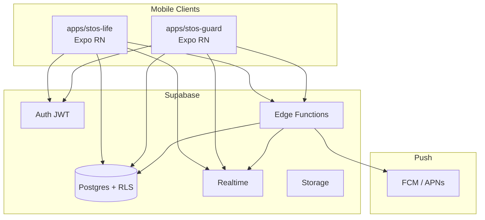
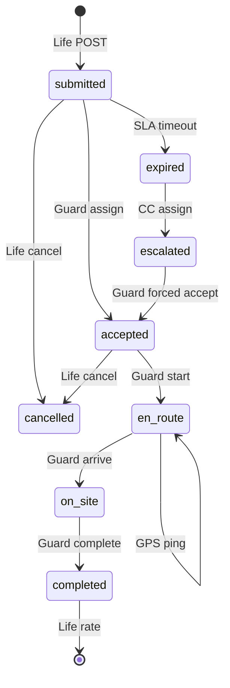
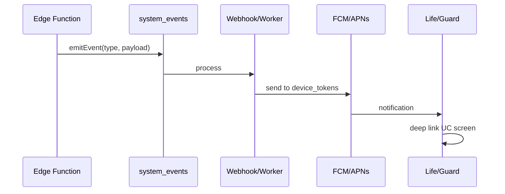
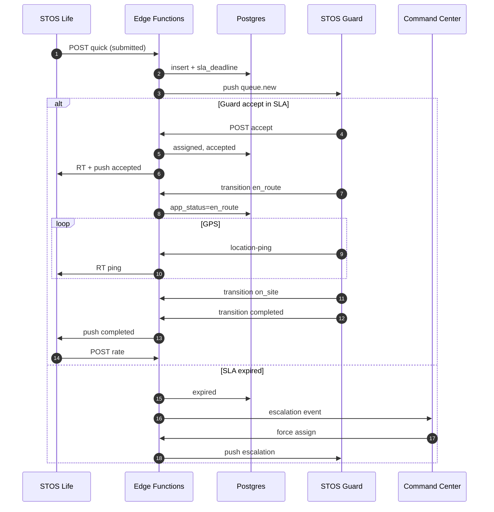

# Tech Spec — STOS Life & STOS Guard (Mobile)
## Technical Specification

| Thuộc tính | Giá trị |
|------------|---------|
| **Phiên bản** | 1.0 |
| **Ngày** | 18/05/2026 |
| **Trạng thái** | Draft — căn cứ SRS v1.0 |
| **SRS** | [STOS_LIFE_SRS.md](./STOS_LIFE_SRS.md), [STOS_GUARD_SRS.md](./STOS_GUARD_SRS.md) |
| **BRD** | [STOS_MOBILE_APPS_BRD.md](./STOS_MOBILE_APPS_BRD.md) |
| **Nền tảng** | Supabase (Postgres + RLS + Realtime + Edge Functions), Expo React Native |

---

## Mục lục

1. [Tổng quan kiến trúc](#1-tổng-quan-kiến-trúc)
2. [Monorepo & ứng dụng](#2-monorepo--ứng-dụng)
3. [Mô hình dữ liệu & trạng thái](#3-mô-hình-dữ-liệu--trạng-thái)
4. [API & Edge Functions](#4-api--edge-functions)
5. [Realtime & Push](#5-realtime--push)
6. [Bảo mật & RLS](#6-bảo-mật--rls)
7. [Ánh xạ SRS → Kỹ thuật (STOS Life)](#7-ánh-xạ-srs--kỹ-thuật-stos-life)
8. [Ánh xạ SRS → Kỹ thuật (STOS Guard)](#8-ánh-xạ-srs--kỹ-thuật-stos-guard)
9. [Luồng liên thông Life ↔ Guard](#9-luồng-liên-thông-life--guard)
10. [Migration & mở rộng schema](#10-migration--mở-rộng-schema)
11. [Offline, hiệu năng, quan sát](#11-offline-hiệu-năng-quan-sát)
12. [Phụ lục kỹ thuật](#12-phụ-lục-kỹ-thuật)

---

## 1. Tổng quan kiến trúc



### 1.1. Nguyên tắc

| # | Nguyên tắc |
|---|------------|
| P-01 | **SRS là nguồn sự thật nghiệp vụ** — mọi API/state machine phải trace được tới UC-ID |
| P-02 | Tái sử dụng bảng hiện có; bổ sung cột/bảng mở rộng khi lifecycle BRD vượt enum DB |
| P-03 | Lifecycle “Grab” dùng **app_status** (JSON metadata hoặc bảng `life_request_events`) |
| P-04 | Guard queue = union `quick_service_requests` + `support_requests` có `resident_id` |
| P-05 | Không duplicate logic dispatch — tập trung Edge Functions |

### 1.2. Khác biệt với `mobile/` hiện có

| Repo path | Vai trò |
|-----------|---------|
| `mobile/` | Command Center thu gọn (operators) — **giữ nguyên** |
| `apps/stos-life/` | **Mới** — cư dân |
| `apps/stos-guard/` | **Mới** — bảo vệ |

---

## 2. Monorepo & ứng dụng

### 2.1. Cấu trúc đề xuất

```
securitech/
  apps/
    stos-life/          # Expo SDK 54+
    stos-guard/
  packages/
    mobile-shared/      # design tokens, api client, types
  supabase/
    functions/
      life-handler/     # NEW — lifecycle Grab, ratings
      guard-handler/    # NEW — attendance, queue, GPS
    migrations/
```

### 2.2. Stack client

| Thành phần | Lựa chọn |
|------------|----------|
| Framework | Expo Router (file-based) |
| State | TanStack Query + Zustand (session) |
| Maps | react-native-maps + Mapbox/OSM tile (MVP-2) |
| Location | expo-location (foreground + task Guard) |
| Auth | `@supabase/supabase-js` |
| Push | `expo-notifications` + Supabase trigger → FCM |

### 2.3. Biến môi trường

| Biến | Life | Guard |
|------|:----:|:-----:|
| `EXPO_PUBLIC_SUPABASE_URL` | ✓ | ✓ |
| `EXPO_PUBLIC_SUPABASE_ANON_KEY` | ✓ | ✓ |
| `EXPO_PUBLIC_APP_ROLE` | `resident` | `guard` |

---

## 3. Mô hình dữ liệu & trạng thái

### 3.1. Bảng hiện có (tái sử dụng)

| Nghiệp vụ | Bảng | Enum DB hiện tại |
|-----------|------|------------------|
| Grab / tiện ích | `quick_service_requests` | `request_status`: open, in_progress, resolved, cancelled |
| Ticket sự cố | `support_requests` | + `request_priority` |
| SOS | `sos_calls` | `sos_status`: pending, dispatched, resolved, false_alarm |
| Khách (walk-in) | `access_logs` | `visitor_type` |
| Bưu phẩm | `parcels` | `parcel_status` |
| Tuần tra | `patrol_routes`, `patrol_checkpoints` | `patrol_status` |
| Ca | `shift_schedules` | string status |
| Nhân viên | `staff_members` | `staff_status` |
| Cư dân | `residents` | — |
| Cộng đồng | `posts`, `announcements` | — |

### 3.2. Lớp trạng thái ứng dụng (`life_request_status`)

DB `request_status` **không đủ** cho BRD (submitted, en_route, on_site, expired). Dùng cột mở rộng:

```sql
-- quick_service_requests + support_requests
ALTER TABLE quick_service_requests
  ADD COLUMN IF NOT EXISTS app_status text,
  ADD COLUMN IF NOT EXISTS priority_tier text DEFAULT 'normal',
  ADD COLUMN IF NOT EXISTS sla_accept_deadline timestamptz,
  ADD COLUMN IF NOT EXISTS lifecycle_meta jsonb DEFAULT '{}';

-- app_status enum (check constraint)
-- submitted | accepted | en_route | on_site | completed | cancelled | expired | escalated
```

**Ánh xạ DB ↔ App:**

| app_status | request_status (DB) | Ghi chú |
|------------|---------------------|---------|
| submitted | open | Chưa assign |
| accepted | open | assigned_to set |
| en_route | in_progress | GPS on |
| on_site | in_progress | |
| completed | resolved | completed_at |
| cancelled | cancelled | |
| expired | open + flag | escalation |
| escalated | open | CC assign |

### 3.3. State machine — Grab (Life + Guard)



### 3.4. Bảng mở rộng (bắt buộc triển khai)

| Bảng | Mục đích | UC |
|------|----------|-----|
| `visitor_invites` | QR khách đăng ký từ Life | LIFE-UC-010/011, GUARD-UC-016 |
| `service_ratings` | Đánh giá 1–5 sao | LIFE-UC-009, GUARD-UC-024 |
| `guard_attendance` | Điểm danh GPS | GUARD-UC-004 |
| `guard_location_pings` | GPS khi en_route | LIFE-UC-007, GUARD-UC-012 |
| `request_declines` | Lý do từ chối queue | GUARD-UC-010 |
| `life_request_events` | Audit timeline | All lifecycle |
| `notification_preferences` | Cài đặt push Life | LIFE-UC-024 |
| `farm_products`, `farm_orders` | Farm Fresh | LIFE-UC-017–019 |
| `building_features` | Feature flags / SLA config | All |

#### DDL rút gọn (tham chiếu migration)

```sql
CREATE TABLE visitor_invites (
  id uuid PRIMARY KEY DEFAULT gen_random_uuid(),
  tenant_id uuid NOT NULL REFERENCES tenants(id),
  building_id uuid NOT NULL REFERENCES buildings(id),
  resident_id uuid NOT NULL REFERENCES residents(id),
  visitor_name text NOT NULL,
  visit_start timestamptz NOT NULL,
  visit_end timestamptz NOT NULL,
  vehicle_plate text,
  purpose text,
  qr_token text UNIQUE NOT NULL,
  status text NOT NULL DEFAULT 'pending', -- pending|checked_in|completed|expired|revoked
  access_log_id uuid REFERENCES access_logs(id),
  created_at timestamptz DEFAULT now()
);

CREATE TABLE service_ratings (
  id uuid PRIMARY KEY DEFAULT gen_random_uuid(),
  tenant_id uuid NOT NULL,
  request_type text NOT NULL, -- quick|support
  request_id uuid NOT NULL,
  resident_id uuid NOT NULL,
  staff_member_id uuid NOT NULL REFERENCES staff_members(id),
  stars int NOT NULL CHECK (stars BETWEEN 1 AND 5),
  comment text,
  created_at timestamptz DEFAULT now(),
  UNIQUE(request_type, request_id)
);

CREATE TABLE guard_location_pings (
  id uuid PRIMARY KEY DEFAULT gen_random_uuid(),
  tenant_id uuid NOT NULL,
  staff_member_id uuid NOT NULL,
  request_id uuid,
  lat double precision NOT NULL,
  lng double precision NOT NULL,
  recorded_at timestamptz DEFAULT now()
);
```

---

## 4. API & Edge Functions

### 4.1. Quy ước HTTP

| Thuộc tính | Giá trị |
|------------|---------|
| Base | `{SUPABASE_URL}/functions/v1/{handler}` |
| Auth | `Authorization: Bearer {jwt}` |
| Tenant | Suy ra từ JWT / `profiles` — **không** tin client |
| Response OK | `{ "success": true, "data": ... }` |
| Response lỗi | `{ "success": false, "error": { "code": "ERR_*", "message": "...", "details": [] } }` |

### 4.2. Handlers hiện có (tái sử dụng)

| Handler | Life | Guard |
|---------|:----:|:-----:|
| `auth-handler` | ✓ | ✓ |
| `resident-handler` | ✓ | — |
| `staff-handler` | — | ✓ |
| `service-handler` | ✓ | ✓ |
| `access-handler` | ✓ (parcels read) | ✓ |
| `sos-handler` | ✓ | ✓ |
| `patrol-handler` | — | ✓ |
| `incident-handler` | ✓ | ✓ |
| `communication-handler` | ✓ | ✓ |

### 4.3. Handler mới: `life-handler`

| Action | Method | Mô tả |
|--------|--------|--------|
| `?action=activate` | POST | Kích hoạt resident (LIFE-UC-001) |
| `?action=cancel-request` | POST | Hủy Grab (LIFE-UC-008) |
| `?action=rate` | POST | Đánh giá (LIFE-UC-009) |
| `?action=visitor-invite` | POST/GET | Khách QR (LIFE-UC-010/011) |
| `?action=preferences` | PATCH | LIFE-UC-024 |

### 4.4. Handler mới: `guard-handler`

| Action | Method | Mô tả |
|--------|--------|--------|
| `?action=attendance` | POST | Điểm danh (GUARD-UC-004) |
| `?action=queue` | GET | Hàng đợi merged (GUARD-UC-008) |
| `?action=accept` | POST | Nhận việc (GUARD-UC-009) |
| `?action=decline` | POST | Từ chối (GUARD-UC-010) |
| `?action=transition` | POST | Lifecycle (GUARD-UC-011) |
| `?action=location-ping` | POST | GPS (GUARD-UC-012) |
| `?action=checkin-visitor` | POST | QR khách (GUARD-UC-016) |

---

## 5. Realtime & Push

### 5.1. Kênh Realtime

| Channel | Subscriber | Sự kiện |
|---------|------------|---------|
| `quick_service_requests:building_id=eq.{id}` | Life, Guard | INSERT/UPDATE |
| `sos_calls:building_id=eq.{id}` | Life, Guard, CC | INSERT/UPDATE |
| `guard_location_pings:request_id=eq.{id}` | Life | INSERT |
| `visitor_invites:resident_id=eq.{id}` | Life | UPDATE |
| `parcels:resident_id=eq.{id}` | Life | INSERT/UPDATE |

### 5.2. Push notification pipeline



### 5.3. Bảng `device_tokens`

```sql
CREATE TABLE device_tokens (
  id uuid PRIMARY KEY DEFAULT gen_random_uuid(),
  user_id uuid NOT NULL,
  app_role text NOT NULL, -- life|guard
  token text NOT NULL,
  platform text NOT NULL, -- ios|android
  UNIQUE(user_id, app_role, token)
);
```

---

## 6. Bảo mật & RLS

### 6.1. Vai trò

| Role | Phạm vi |
|------|---------|
| `resident` | `residents.user_id = auth.uid()` |
| `guard` | `staff_members.user_id = auth.uid()` |
| `tenant_staff` | Command Center — ngoài mobile spec |

### 6.2. Chính sách mẫu

```sql
-- residents: cư dân chỉ đọc bản thân
CREATE POLICY resident_self ON residents
  FOR SELECT USING (user_id = auth.uid());

-- quick_service_requests: Life tạo/đọc của mình
CREATE POLICY resident_requests ON quick_service_requests
  FOR ALL USING (
    resident_id IN (SELECT id FROM residents WHERE user_id = auth.uid())
  );

-- Guard đọc queue cùng building đang ca
CREATE POLICY guard_building_queue ON quick_service_requests
  FOR SELECT USING (
    building_id IN (
      SELECT building_id FROM staff_members WHERE user_id = auth.uid()
    )
  );
```

### 6.3. Kiểm tra server-side (bắt buộc)

| Rule | Nơi enforce |
|------|-------------|
| BR-LIFE-03 cancel | `life-handler` reject if app_status ≥ en_route |
| BR-GUARD-01 duty | `guard-handler` except SOS |
| BR-GUARD-04 no decline critical | `guard-handler` decline |
| BR-GUARD-05 max concurrent | `guard-handler` accept count |
| BR-GUARD-07 QR validity | `guard-handler` checkin-visitor |

---

## 7. Ánh xạ SRS → Kỹ thuật (STOS Life)

> Mỗi UC: **API**, **Sequence kỹ thuật** (bảng), **Validation server**, **Lỗi**, **DB**.

---

### LIFE-UC-001 — Đăng nhập & Kích hoạt

| Hạng mục | Chi tiết |
|----------|----------|
| **Màn hình** | `app/(auth)/login.tsx`, `activate.tsx` |
| **API** | Supabase Auth; `GET /resident-handler?id=` filter `user_id`; `POST /life-handler?action=activate` |
| **Validation** | `activation_code` HMAC, single-use, expiry 72h |

#### Sequence kỹ thuật

| # | Component | Action | Input | Validation | Output | Branch |
|---|-----------|--------|-------|------------|--------|--------|
| 1 | App | signIn | email, password | format | session / 401 | fail→ERR-AUTH-01 |
| 2 | App | fetchResident | user_id | count=1 | resident | 0→activate |
| 3 | App | secureStore | resident_id, building_id | — | — | success |

---

### LIFE-UC-003–005 — Grab: Tạo yêu cầu

| Hạng mục | Chi tiết |
|----------|----------|
| **Màn hình** | `grab/index.tsx`, `grab/confirm.tsx` |
| **API** | `POST /service-handler?type=quick` + post-process `life-handler` set `app_status=submitted` |
| **Pre-check** | `GET quick_service_requests?status=open&resident_id` — 409 nếu có active |

#### Sequence kỹ thuật (UC-005)

| # | Component | Action | Input | Validation | Output | Branch |
|---|-----------|--------|-------|------------|--------|--------|
| 1 | App | validate draft | service_type, description | catalog contains type | — | invalid→ERR-VAL-01 |
| 2 | App | POST quick | building_id, resident_id, service_type, description | RLS resident | 201 row | net→ERR-NET-01 |
| 3 | life-handler | set lifecycle | request_id | — | app_status=submitted, sla_deadline=now+5m | — |
| 4 | life-handler | emitEvent | life_request_created | — | — | — |
| 5 | guard-handler | notify queue | building_id | guards on_duty | push guard.queue.new | — |
| 6 | App | subscribe RT | request_id | — | UI submitted | — |

**Request body:**

```json
{
  "building_id": "uuid",
  "resident_id": "uuid",
  "service_type": "open_door",
  "description": "Cửa chính bị kẹt",
  "priority_tier": "normal"
}
```

**Response 201:**

```json
{
  "id": "uuid",
  "status": "open",
  "app_status": "submitted",
  "sla_accept_deadline": "2026-05-18T15:10:00Z"
}
```

---

### LIFE-UC-006–007 — Theo dõi trạng thái & Map

| Hạng mục | Chi tiết |
|----------|----------|
| **API** | Realtime UPDATE `quick_service_requests`; `guard_location_pings` INSERT |
| **App** | Map chỉ render khi `app_status=en_route` |

#### Sequence — chuyển en_route

| # | Component | Action | Input | Validation | Output | Branch |
|---|-----------|--------|-------|------------|--------|--------|
| 1 | Guard | transition en_route | request_id | assignee=guard | app_status=en_route | — |
| 2 | guard-handler | start GPS task | request_id | — | pings | — |
| 3 | Life RT | receive ping | lat,lng | — | marker update | no GPS→banner |
| 4 | Life | compute ETA | dest=apartment geo | — | display ETA | — |

---

### LIFE-UC-008 — Hủy yêu cầu

| API | `POST /life-handler?action=cancel-request` |
| Body | `{ "request_id", "reason" }` |
| Server | If `app_status` IN (`en_route`,`on_site`) → **403** ERR-REQ-03 |
| DB | `app_status=cancelled`, `status=cancelled` |

---

### LIFE-UC-009 — Đánh giá

| API | `POST /life-handler?action=rate` |
| Body | `{ "request_type", "request_id", "stars", "comment?" }` |
| Validation | `app_status=completed`; unique rating |
| Side effect | stars≤2 → `emitEvent(low_rating_alert)` → CC |

---

### LIFE-UC-010–011 — Khách QR

| API POST | `/life-handler?action=visitor-invite` |
| Body | visitor_name, visit_start, visit_end, vehicle_plate?, purpose? |
| Server | visit_start < visit_end; visit_end ≤ start+48h; generate `qr_token` |
| Response | `{ invite_id, qr_payload: "STOS:{token}", display_code }` |

#### Sequence check-in (phía Guard — UC-016)

| # | Component | Action | Input | Validation | Output | Branch |
|---|-----------|--------|-------|------------|--------|--------|
| 1 | Guard | scan QR | token | invite valid, building match, now in window | guest | else ERR-QR-01 |
| 2 | guard-handler | create access_log | — | — | access_log_id | — |
| 3 | guard-handler | update invite | status=checked_in | — | — | — |
| 4 | life-handler | push | resident_id | — | guest.checked_in | — |

---

### LIFE-UC-012–013 — Bưu phẩm

| API | `GET /access-handler?action=parcels&resident_id={id}&status=` |
| RLS | resident chỉ đọc `resident_id` own |
| Push | Subscribe `parcels` INSERT |

---

### LIFE-UC-014 — Ticket sự cố

| API | `POST /service-handler?type=support` |
| Body | title, description, category, priority |
| Guard queue | Hiển thị trong `guard-handler?action=queue` với badge support |

---

### LIFE-UC-016 — SOS

| API | `POST /sos-handler` (existing) |
| Body | building_id, resident_id, lat?, lng?, location_description? |
| Sequence | See §9.2 — parallel notify all guards + CC alert |

**Client:** Hold button `onPressIn` timer 3000ms; cancel on `onPressOut` < 3000ms.

---

### LIFE-UC-017–019 — Farm Fresh

| API (new) | `farm-handler` hoặc nested `life-handler?action=farm-*` |
| Tables | `farm_products`, `farm_orders` — **tách** khỏi `quick_service_requests` (BR-LIFE-07) |

---

### LIFE-UC-020–021 — Cộng đồng

| API | `GET /communication-handler?type=posts|announcements&building_id=` |
| MVP | Read-only |

---

### LIFE-UC-022–026 — Tài khoản, SLA

| UC | API |
|----|-----|
| 022 | `GET /resident-handler?id=` |
| 023 | `GET /service-handler` merged client-side |
| 024 | `PATCH /life-handler?action=preferences` |
| 026 | Cron `pg_cron` / Edge scheduled: mark `expired` + emit escalation |

#### SLA Job (UC-026)

| # | Component | Action | Condition | Output |
|---|-----------|--------|-----------|--------|
| 1 | scheduler | scan open requests | now > sla_accept_deadline AND assignee null | app_status=expired |
| 2 | scheduler | emit | — | cc.escalation + life.push |
| 3 | Life | UI | — | hotline + resubmit | |

---

## 8. Ánh xạ SRS → Kỹ thuật (STOS Guard)

---

### GUARD-UC-001 — Đăng nhập

| API | Auth + `GET /staff-handler?user_id=` |
| Store | staff_id, building_id, employee_id |

---

### GUARD-UC-004 — Điểm danh

| API | `POST /guard-handler?action=attendance` |
| Body | `{ "staff_member_id", "shift_schedule_id", "lat", "lng", "zone_id" }` |

#### Sequence

| # | Component | Action | Input | Validation | Output | Branch |
|---|-----------|--------|-------|------------|--------|--------|
| 1 | App | getCurrentPosition | — | accuracy≤50m | coords | denied→ERR-GPS-01 |
| 2 | App | POST attendance | coords, zone | haversine(zone)≤radius_m | attendance_id | far→ERR-LOC-01 |
| 3 | App | update staff | last_check_in | — | on_duty=true | — |
| 4 | DB | staff_members | status=stationary | — | — | — |

**Config `building_features`:**

```json
{
  "attendance_zones": [
    { "id": "gate_main", "lat": 10.77, "lng": 106.69, "radius_m": 80 }
  ]
}
```

---

### GUARD-UC-005–007 — Tuần tra

| API | `patrol-handler` (existing) — extend PATCH checkpoint |
| Missed | Scheduled job: `end_time < now()` AND completion < 100 → status=missed, emit patrol_violation |

#### Sequence checkpoint (UC-006)

| # | Component | Action | Input | Validation | Output | Branch |
|---|-----------|--------|-------|------------|--------|--------|
| 1 | App | scan QR / tap | checkpoint_id | belongs active route | — | wrong→ERR-CP-01 |
| 2 | patrol-handler | PATCH checkpoint | completed=true | — | completion recalc | — |
| 3 | App | UI progress | — | — | if 100% → UC-007 complete | — |

---

### GUARD-UC-008–011 — Hàng đợi Life

#### GET Queue

`GET /guard-handler?action=queue&building_id=`

**Response:**

```json
{
  "items": [
    {
      "id": "uuid",
      "source": "quick",
      "service_type": "open_door",
      "priority_tier": "high",
      "app_status": "submitted",
      "apartment": "12.08",
      "resident_name": "Nguyễn A",
      "created_at": "...",
      "sla_accept_deadline": "..."
    }
  ]
}
```

**Sort:** `priority_tier DESC`, `created_at ASC`.

#### Accept (UC-009) — Sequence

| # | Component | Action | Input | Validation | Output | Branch |
|---|-----------|--------|-------|------------|--------|--------|
| 1 | App | POST accept | request_id, source | on_duty; active_count < N | assigned | busy→ERR-REQ-05 |
| 2 | guard-handler | optimistic lock | row version | assignee null | assignee=staff_id, app_status=accepted | race→ERR-REQ-06 |
| 3 | guard-handler | emit | life_request_accepted | — | Life push | — |
| 4 | App | navigate detail | — | — | — | — |

#### Transition (UC-011)

`POST /guard-handler?action=transition`

```json
{
  "request_id": "uuid",
  "source": "quick",
  "to_status": "on_site",
  "completion_note": "Đã mở cửa"
}
```

| to_status | Validation | Side effects |
|-----------|------------|--------------|
| en_route | from accepted | start GPS task |
| on_site | from en_route | stop GPS optional |
| completed | from on_site | require note if incident; status=resolved; notify Life |

---

### GUARD-UC-010 — Decline

`POST /guard-handler?action=decline`

| Input | Validation |
|-------|------------|
| reason (enum + text) | required |
| priority_tier != critical | else 403 ERR-REQ-07 |

Insert `request_declines`; requeue broadcast.

---

### GUARD-UC-012 — GPS Pings

`POST /guard-handler?action=location-ping` every 10s while en_route.

| Field | Rule |
|-------|------|
| lat/lng | required |
| request_id | must be assigned to self |
| rate limit | max 1/5s per request |

---

### GUARD-UC-014–015 — SOS

| UC | API | Ghi chú |
|----|-----|---------|
| 014 | POST sos-handler (caller=staff) | bypass duty check |
| 015 | PATCH sos-handler accept/resolve | compete dispatch — first wins |

---

### GUARD-UC-016–018 — Ra vào

| UC | API |
|----|-----|
| 016 | POST guard-handler checkin-visitor |
| 017 | PATCH access-handler checkout |
| 018 | POST access-handler access_logs |

---

### GUARD-UC-019–020 — Parcels

| UC | API |
|----|-----|
| 019 | POST access-handler?action=parcels |
| 020 | PATCH parcels status |

---

### GUARD-UC-023 — Lương KPI

| API | `GET /finance-handler?action=payroll&employee_id=` + aggregate ratings/patrol |
| Guard | **GET only** — PATCH trả ERR-PAY-01 |

---

## 9. Luồng liên thông Life ↔ Guard

### 9.1. End-to-end Grab (tổng hợp SRS UC Life 003–009 + Guard 008–012)



### 9.2. SOS cư dân (LIFE-UC-016 + GUARD-UC-015)

| # | Component | Action | Input | Validation | Output | Branch |
|---|-----------|--------|-------|------------|--------|--------|
| 1 | Life | hold 3s + POST sos | lat,lng | — | sos pending | — |
| 2 | sos-handler | insert + dispatch | building | on-patrol guard? | dispatched / pending | no guard→CC |
| 3 | sos-handler | parallel | — | — | push ALL guards + CC alert | — |
| 4 | Guard | PATCH accept | sos_id | first lock | dispatched_guard_id | else ERR |
| 5 | Guard | resolve | notes | — | resolved → Life RT | false_alarm |

### 9.3. Bảng sự kiện `system_events`

| event_type | Producer | Consumers |
|------------|----------|-----------|
| `life_request_created` | life-handler | Guard push |
| `life_request_accepted` | guard-handler | Life push |
| `life_request_en_route` | guard-handler | Life push + map |
| `life_request_completed` | guard-handler | Life push |
| `life_request_expired` | scheduler | Life UI + CC |
| `sos_triggered` | sos-handler | Guard + CC |
| `parcel_received` | access-handler | Life push |
| `guest_checked_in` | guard-handler | Life push |
| `patrol_violation` | patrol job | CC + Guard |

---

## 10. Migration & mở rộng schema

### 10.1. Thứ tự triển khai

| Phase | Migration | MVP |
|-------|-----------|-----|
| 1 | `app_status`, `sla_accept_deadline`, indexes | MVP-1 Life+Guard queue |
| 2 | `visitor_invites`, `service_ratings` | MVP-2 |
| 3 | `guard_attendance`, `guard_location_pings` | MVP-2 map |
| 4 | `farm_*`, `building_features` | MVP-4 |
| 5 | RLS policies + device_tokens | MVP-1 push |

### 10.2. Index đề xuất

```sql
CREATE INDEX idx_qsr_building_status ON quick_service_requests(building_id, app_status);
CREATE INDEX idx_qsr_sla ON quick_service_requests(sla_accept_deadline) WHERE assigned_to IS NULL;
CREATE INDEX idx_pings_request_time ON guard_location_pings(request_id, recorded_at DESC);
```

---

## 11. Offline, hiệu năng, quan sát

| Topic | Life | Guard |
|-------|------|-------|
| Offline | Không tạo request; cache lịch sử | Queue patrol tick local → sync |
| GPS | Chỉ consume pings | Foreground service khi en_route |
| Logging | Sentry + `life_request_events` | Same |
| Metrics | time_to_accept, time_to_complete | accept_rate, patrol_completion |

---

## 12. Phụ lục kỹ thuật

### 12.1. Ma trận UC → Handler

| UC IDs | Handler chính |
|--------|---------------|
| LIFE-001,008,009,010,011,024,026 | life-handler |
| LIFE-003–007,014,015,023 | service-handler + life-handler |
| LIFE-012,013,025 | access-handler |
| LIFE-016 | sos-handler |
| LIFE-020,021 | communication-handler |
| GUARD-004,008–012,016,025 | guard-handler |
| GUARD-005–007 | patrol-handler |
| GUARD-013 | incident-handler |
| GUARD-014,015 | sos-handler |
| GUARD-016–020 | access-handler |
| GUARD-023 | finance-handler |

### 12.2. Mã lỗi HTTP mapping

| ERR_* | HTTP | Khi nào |
|-------|------|---------|
| ERR-AUTH-01 | 401 | JWT invalid |
| ERR-REQ-02 | 409 | Duplicate active request |
| ERR-REQ-03 | 403 | Cancel en_route |
| ERR-REQ-05 | 409 | Guard max concurrent |
| ERR-REQ-06 | 409 | Accept race |
| ERR-REQ-07 | 403 | Decline critical |
| ERR-LOC-01 | 422 | Attendance geofence |
| ERR-QR-01 | 422 | Invalid guest QR |

### 12.3. `building_features` schema

```json
{
  "life_enabled": true,
  "sla_accept_minutes": 5,
  "auto_complete_minutes": 15,
  "max_concurrent_requests_per_guard": 1,
  "service_catalog": [
    { "code": "open_door", "label": "Mở cửa", "icon": "door" }
  ],
  "farm_fresh_enabled": false
}
```

### 12.4. Traceability matrix (SRS → Tech)

| SRS Document | Section | Tech Spec Section |
|--------------|---------|-------------------|
| STOS_LIFE_SRS | §7 UC-003–009 | §7 LIFE Grab, §9.1 |
| STOS_LIFE_SRS | §7 UC-016 | §7 LIFE SOS, §9.2 |
| STOS_GUARD_SRS | §7 UC-004 | §8 GUARD attendance |
| STOS_GUARD_SRS | §7 UC-008–012 | §8 queue, §9.1 |
| STOS_GUARD_SRS | §7 UC-005–007 | §8 patrol |

---

## Phê duyệt kỹ thuật

| Vai trò | Họ tên | Ngày |
|---------|--------|------|
| Tech Lead | | |
| Mobile Lead | | |
| Backend / Supabase | | |

---

*Mọi thay đổi API hoặc schema phải cập nhật đồng thời SRS (hành vi) và tài liệu này (triển khai).*
